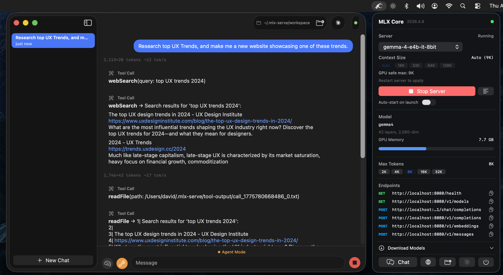

# mlx-serve

**[ddalcu.github.io/mlx-serve](https://ddalcu.github.io/mlx-serve/)**

Native Zig server that runs MLX-format language models on Apple Silicon and exposes OpenAI-compatible and Anthropic-compatible HTTP APIs. No Python. Comes with **MLX Core**, a macOS menu bar app with built-in chat, agent mode, and model management.



[](https://github.com/ddalcu/mlx-serve/releases/latest) **[Download MLX Core.app](https://github.com/ddalcu/mlx-serve/releases/latest)** — latest release for macOS (Apple Silicon)

## Features

- OpenAI-compatible API (`/v1/chat/completions`, `/v1/completions`, `/v1/models`)
- Anthropic-compatible API (`/v1/messages`) — works with Claude Code
- Streaming and non-streaming responses
- Tool calling (function calling) with automatic detection
- KV cache reuse across requests for fast multi-turn conversations
- Sampling: temperature, top-k, top-p, repeat penalty, presence penalty
- Reasoning/thinking mode support
- Chat templates via Jinja2 (Jinja_cpp) with fallback formatting
- TUI status bar with CPU, memory, and GPU metrics

## MLX Core (macOS App)

Menu bar app that wraps the server with a full UI:

- **Model browser** -- download models from HuggingFace with resumable downloads
- **Chat interface** -- multi-session chat with markdown rendering
- **Agent mode** -- 8 built-in tools (shell, readFile, writeFile, editFile, searchFiles, browse, webSearch, saveMemory) with automatic tool calling loop
- **Editable system prompt** -- customize agent behavior via `~/.mlx-serve/system-prompt.md` (Agent menu → Edit System Prompt)
- **Persistent memory** -- agent can save memories across sessions to `~/.mlx-serve/memory.md`
- **Prompt-based skills** -- drop `.md` files in `~/.mlx-serve/skills/` to teach the agent custom capabilities
- **Server management** -- start/stop server, view logs, configure max tokens

## Supported Models

| Architecture | Examples | Chat Format |
|---|---|---|
| **Gemma 4** | `gemma-4-e2b-it-4bit`, `gemma-4-e4b-it-8bit`, `gemma-4-26b-a4b-it-4bit` | Gemma turns |
| **Gemma 3** | `gemma-3-12b-it-qat-4bit` | Gemma turns |
| **Qwen 3 / 3.5** | `Qwen3-4B`, `Qwen3.5-MoE`, `Qwen3-next` | ChatML |
| **Llama / Mistral** | Llama 3, Mistral | ChatML / Llama-3 |

Any quantized MLX model using one of the above architectures should work.

## Prerequisites

- macOS with Apple Silicon (M1/M2/M3/M4)
- [Zig 0.15+](https://ziglang.org/download/)
- mlx-c:

```bash
brew install mlx-c
```

## Quick Start

### Download a model

The MLX Core app can download models directly, or use the CLI:

```bash
pip install huggingface-hub
huggingface-cli download mlx-community/gemma-4-e4b-it-4bit --local-dir ~/.mlx-serve/models/gemma-4-e4b-it-4bit
```

### Build and run

```bash
zig build -Doptimize=ReleaseFast
./zig-out/bin/mlx-serve --model ~/.mlx-serve/models/gemma-4-e4b-it-4bit --serve --port 8080
```

### Build the app

```bash
cd app && SKIP_NOTARIZE=1 bash build.sh
open "MLX Core.app"
```

Requires `APPLE_DEVELOPER_ID` and `APPLE_TEAM_ID` environment variables for code signing.

## Usage

### Interactive mode

```bash
./zig-out/bin/mlx-serve --model /path/to/model --prompt "What is 2+2?"
```

### HTTP server

```bash
./zig-out/bin/mlx-serve --model /path/to/model --serve --port 8080
```

### CLI options

| Flag | Default | Description |
|---|---|---|
| `--model PATH` | required | Path to the MLX model directory |
| `--serve` | off | Start the HTTP server |
| `--host ADDR` | `127.0.0.1` | Host address to bind |
| `--port N` | `8080` | Port for the HTTP server |
| `--prompt TEXT` | `"Hello"` | Prompt for interactive mode |
| `--max-tokens N` | `100` | Maximum tokens to generate |
| `--temp F` | `0.0` | Sampling temperature (0 = greedy) |
| `--ctx-size N` | auto | Context window size (auto = computed from GPU memory) |
| `--timeout N` | `300` | Request timeout in seconds |
| `--reasoning-budget N` | `0` | Thinking token budget (0 = disabled) |
| `--log-level` | `info` | Log level (error, warn, info, debug) |

## API

### POST /v1/chat/completions

```bash
curl http://localhost:8080/v1/chat/completions \
  -H "Content-Type: application/json" \
  -d '{
    "messages": [{"role": "user", "content": "Write a haiku about programming."}],
    "max_tokens": 256,
    "stream": true
  }'
```

Supports `messages`, `max_tokens`, `temperature`, `top_p`, `top_k`, `stream`, `tools`, `repetition_penalty`, `presence_penalty`, and `logprobs`.

### POST /v1/messages (Anthropic)

```bash
curl http://localhost:8080/v1/messages \
  -H "Content-Type: application/json" \
  -H "anthropic-version: 2023-06-01" \
  -d '{
    "model": "mlx-serve",
    "max_tokens": 256,
    "messages": [{"role": "user", "content": "Write a haiku about programming."}]
  }'
```

Compatible with Claude Code (`ANTHROPIC_BASE_URL=http://localhost:8080 claude`) and Anthropic SDKs. Supports streaming, tool calling, and extended thinking.

### Other endpoints

- `GET /health` -- health check
- `GET /v1/models` -- list loaded models
- `POST /v1/completions` -- text completions
- `POST /v1/messages` -- Anthropic Messages API

## Performance

Benchmarked on Apple M4 (16 GB unified memory):

| Model | Prefill | Decode | Memory |
|---|---|---|---|
| Gemma-4 E4B (4-bit) | ~300 tok/s | ~33 tok/s | 4.0 GB |
| Qwen3-4B (4-bit) | ~220 tok/s | ~37 tok/s | 2.17 GB |

Matches mlx-lm (Python) generation speed while using less memory and starting 3x faster. Key optimizations: fully-lazy async pipeline with reordered eval (submit-first pattern), JIT-compiled activations (GELU, GeGLU, softcap via `mlx_compile`), and GPU memory wiring.

<details>
<summary>Benchmark reproduction</summary>

```bash
# Prefill (~840 token prompt):
./zig-out/bin/mlx-serve --model ~/.mlx-serve/models/gemma-4-e4b-it-4bit \
  --prompt "$(python3 -c "print('Explain the following topics in extreme detail: ' + ', '.join([f'topic {i} about science and technology and its impact on human civilization throughout history' for i in range(1,50)]))")" \
  --max-tokens 1

# Decode (256 tokens, temp=0):
./zig-out/bin/mlx-serve --model ~/.mlx-serve/models/gemma-4-e4b-it-4bit \
  --prompt "Write a detailed essay about quantum computing" \
  --max-tokens 256
```

Run 3 times and take the average of runs 2-3 (run 1 includes model loading from disk).
</details>

## License

MIT
