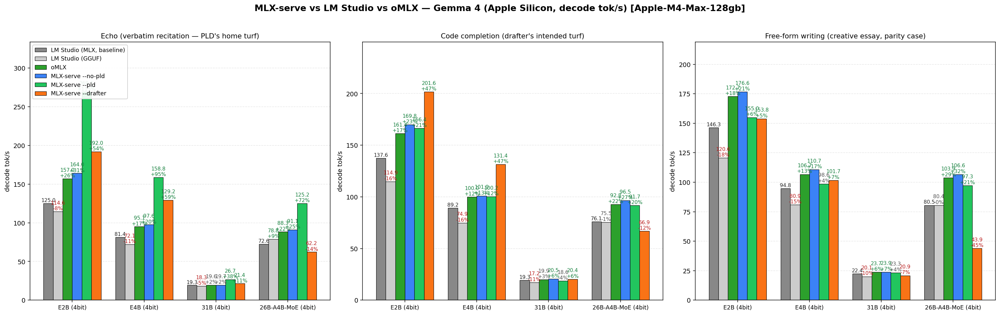
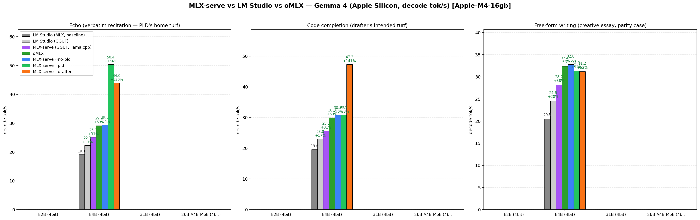
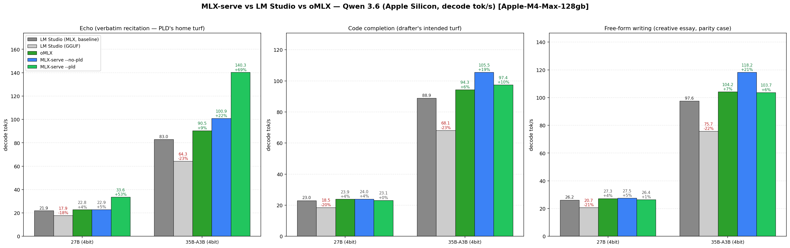

# mlx-serve — run any LLM on your Mac

**OpenAI- and Anthropic-compatible local inference for Apple Silicon — MLX *and* GGUF — faster than LM Studio on the same file. No Python. No cloud. No Electron.**

[](https://github.com/ddalcu/mlx-serve/releases/latest)
[](https://github.com/ddalcu/mlx-serve/stargazers)
[](https://github.com/ddalcu/mlx-serve/releases)
[](https://github.com/ddalcu/mlx-serve/commits/main)
[](LICENSE)
[](https://github.com/ddalcu/mlx-serve/releases/latest)
[](https://ziglang.org)

**[ddalcu.github.io/mlx-serve](https://ddalcu.github.io/mlx-serve/)** · [Download MLX Core.app](https://github.com/ddalcu/mlx-serve/releases/latest) · [Changelog](CHANGELOG.md)

> ★ **If mlx-serve saves you from spinning up another Electron app, [star the repo](https://github.com/ddalcu/mlx-serve/stargazers) — it genuinely helps people find this.**

mlx-serve is a native Zig server that runs **any LLM on Apple Silicon** — MLX-format models *and* every GGUF on HuggingFace (Qwen, Llama, Mistral, Gemma, DeepSeek V4 Flash, thousands more). It exposes **OpenAI-compatible** *and* **Anthropic-compatible** HTTP APIs out of the box, so the same `http://localhost:11234` works with Claude Code, the OpenAI SDK, Continue, Cursor, Open WebUI, and anything else that speaks one of those wires. Ships with **MLX Core**, a macOS menu-bar app with chat, agent mode, MCP tool calling, and model management.


[](https://github.com/ddalcu/mlx-serve/releases/latest) **[Download MLX Core.app](https://github.com/ddalcu/mlx-serve/releases/latest)** — latest release for macOS (Apple Silicon)

### Install via Homebrew

```bash
brew tap ddalcu/mlx-serve https://github.com/ddalcu/mlx-serve
brew install --cask mlx-core   # GUI menu bar app
brew install mlx-serve          # CLI server only
```

## Why mlx-serve

If you're already on LM Studio, Ollama, or `mlx-lm` and wondering whether to switch — here's the short version, head-to-head:

| | mlx-serve | LM Studio | Ollama | mlx-lm |
|---|:---:|:---:|:---:|:---:|
| MLX models (native Apple) | ✅ | ✅ | ❌ | ✅ |
| GGUF models (llama.cpp) | ✅ **embedded** | ✅ | ✅ | ❌ |
| OpenAI-compatible API | ✅ | ✅ | partial | ❌ |
| Anthropic Messages API | ✅ | ❌ | ❌ | ❌ |
| OpenAI Responses API + WebSockets | ✅ | ❌ | ❌ | ❌ |
| DeepSeek V4 Flash (284B) | ✅ via ds4 | ❌ | ❌ | ❌ |
| Speculative decoding (PLD + drafter) | ✅ | ❌ | partial | drafter only |
| Decode speed (geomean vs LM Studio, identical weights) | **+35%** (MLX) | baseline | ~−15% (GGUF, est.¹) | +11% (MLX) |
| KV-cache quantization (4/8-bit + TurboQuant) | ✅ | ❌ | partial | ✅ |
| Continuous batching | ✅ | ❌ | ✅ | ❌ |
| Built-in agent loop + MCP client | ✅ 10 tools | ❌ | ❌ | ❌ |
| One-click launchers (Claude Code, OpenCode, Pi) | ✅ | ❌ | ❌ | ❌ |
| Python required at runtime | ❌ | ❌ | ❌ | ✅ |
| Native menu-bar app (no Electron) | ✅ | ❌ Electron | ❌ | ❌ |
| License | MIT | proprietary | MIT | MIT |

¹ Ollama can't run MLX, so the comparison is GGUF-vs-GGUF. 

### Benchmarks (Apple M4, 16 GB · identical weights · ctx=4096 · temp=0)

**Same `.gguf` file, both engines:** mlx-serve's embedded llama.cpp beats LM Studio's wrapper on `gemma-4-E4B-it-Q4_K_M.gguf`:

| Workload | LM Studio (GGUF) | mlx-serve (GGUF) | Δ |
|---|---:|---:|---:|
| Free-form decode | 24.6 tok/s | **28.2 tok/s** | **+15%** |
| Echo | 22.3 | **25.1** | **+13%** |
| Code completion | 23.0 | **25.7** | **+12%** |
| Prefill | 349 | **367** | **+5%** |

**Same 4-bit MLX weights**, plus mlx-serve's optional speculative-decode wins:

| Model | Workload | LM Studio | mlx-serve | mlx-serve + PLD | mlx-serve + Drafter |
|---|---|---:|---:|---:|---:|
| Gemma 4 E2B | Echo | 125 tok/s | 164 (**+31%**) | **269 (+115%)** | 192 (+54%) |
| Gemma 4 E4B | Code | 89.2 | 101 (+13%) | 100 | **131 (+47%)** |
| Gemma 4 26B-A4B MoE | Echo | 72.6 | 91.1 (+25%) | **125 (+72%)** | — |
| Qwen 3.6 35B-A3B MoE | Echo | 83.0 | 101 (+22%) | **140 (+69%)** | — |

Across 18 cells (best mlx-serve vs best LM Studio, geomean): **+35%**. Reproduce with [`tests/bench.sh --family gemma --lmstudio --omlx`](tests/bench.sh).




## Features

- **Run any LLM** — every supported MLX architecture *and* the entire GGUF universe via embedded llama.cpp. DeepSeek V4 Flash runs through the dedicated [antirez/ds4](https://github.com/antirez/ds4) engine.
- **OpenAI-compatible API** — `/v1/chat/completions`, `/v1/completions`, `/v1/embeddings`, `/v1/models`, streaming SSE, tools, JSON-schema constrained decoding, logprobs.
- **OpenAI Responses API** — `/v1/responses` with `previous_response_id` chains, per-event `sequence_number`, the `/v1/responses/compact` opaque history blob, and a WebSocket transport on the same endpoint.
- **Anthropic Messages API** — `/v1/messages` works with Claude Code (`ANTHROPIC_BASE_URL=http://localhost:11234`) and the Anthropic SDK.
- **Speculative decoding** — PLD (model-agnostic n-gram lookup, on by default) + the Gemma 4 cross-attention drafter. Adaptive prompt-time and runtime gates keep novel-content workloads at parity; agentic code loops see up to 1.6×.
- **KV-cache quantization** — 4-bit / 8-bit / TurboQuant variants shrink KV memory ~4× / ~2× / further still, so 16K contexts fit on hardware that couldn't hold them dense.
- **Continuous batching** — `--max-concurrent N` batches decode requests through one forward pass for ~1.6× throughput at 4-way parallel.
- **Prefix cache** — shared system-prompt KV reuse across turns and across conversations. v26.5.7 adds an LRU of llama.cpp KV sessions so multi-doc agent loops stay warm.
- **Tokenize cache** — chat-template render + tokenize cached per request; the second hit on a long conversation is a memcpy. Warm TTFT 7.7× faster on 1.8K-token prompts.
- **Vision** — Gemma 4 SigLIP encoder; send images via `image_url` content blocks.
- **Reasoning / thinking** — full streaming of thinking tokens as `reasoning_content`.
- **No Python** — single Zig binary, no `pip`, no venv. The MLX Core app ships everything signed and notarized.

## MLX Core (macOS App)

Menu-bar app that wraps the server with a full UI:

- **Model browser** — download from HuggingFace with resumable transfers, auto-discovers LM Studio's existing model folder (`~/.lmstudio/settings.json`) so you don't re-download what's on disk, GGUF rows show a min–max RAM-estimate range.
- **Chat interface** — multi-session chat with markdown rendering. Drop in PDFs (PDFKit-extracted) or images alongside text.
- **Agent mode** — 10 built-in tools (shell, cwd, readFile, writeFile, editFile, searchFiles, listFiles, browse, webSearch, saveMemory) with automatic tool calling loop and a per-tool approval dialog (**Allow** / **Deny** / **Always allow this session**).
- **MCP client** — curated marketplace of stdio + HTTP MCP servers (GitHub, Azure DevOps, DBHub, Docker, Kubernetes, Playwright, Slack, Notion, Filesystem, Shell) plus your own from `~/.mlx-serve/mcp.json`.
- **Editable system prompt + persistent memory** — `~/.mlx-serve/system-prompt.md` and `~/.mlx-serve/memory.md`.
- **Prompt-based skills** — drop `.md` files into `~/.mlx-serve/skills/` with YAML frontmatter to teach the agent custom capabilities triggered by keywords.
- **Engine-aware Settings window** (Cmd+,) — every server-launch flag and per-request default, with sections that show only the knobs relevant to the engine you've loaded (MLX vs GGUF vs ds4).
- **Server management** — start/stop, live log buffer, restart-on-flag-change banner.
- **Image / Video Generation (optional)** — FLUX.2 and LTX-Video 2.3 through a Python subprocess (the Zig server itself stays Python-free; see below).

### Image / Video Generation (optional)

The tray has **ImageGen** and **VideoGen** buttons that run [FLUX.2](https://huggingface.co/black-forest-labs) and [LTX-Video 2.3](https://github.com/dgrauet/ltx-2-mlx) through a Python subprocess. Both run natively on MLX — no MPS/diffusers path. This is completely optional — the Zig server itself remains Python-free.

**Prerequisite:** Python 3 and ffmpeg must be installed on your Mac.

```bash
brew install python ffmpeg
```

Then launch MLX Core, click the ImageGen (or VideoGen) tray icon, and hit **Install** in the window. The app will:

1. Create a dedicated venv at `~/.mlx-serve/venv` (does not touch your system Python)
2. Install mflux (FLUX), ltx-pipelines-mlx (LTX-2.3), and shared utilities. ~3 GB pip install.
3. Download the model weights on first generation (HuggingFace cache, resumable)

**Models:**

| Feature | Default | Other options | Approx. RAM |
|---|---|---|---|
| Image | FLUX.2-klein 4B 4-bit (mflux, ~5 GB pre-quantized) | FLUX.1-schnell / dev 4-bit and 8-bit | 8 / 12 / 16 GB |
| Video | LTX-Video 2.3 Q4 | — | 24 GB RAM, ~50 GB first-run download (LTX 41 GB + Gemma 8 GB) |

> The 41 GB LTX snapshot ships **both** transformer variants (1-stage distilled + 2-stage dev, ~11 GB each) plus a 7.6 GB distillation LoRA, so you can switch between Fast/Good/Quality/Super offline without re-downloading.

The image path uses [`mflux`](https://github.com/filipstrand/mflux) for native MLX inference with built-in 4/8-bit quantization. The video path uses [`ltx-2-mlx`](https://github.com/dgrauet/ltx-2-mlx) with audio generation (muxed via system `ffmpeg`).

Outputs go to `~/.mlx-serve/generations/images/YYYY-MM-DD/` and `.../videos/YYYY-MM-DD/`.

> The app won't let you start a generation if there isn't enough free RAM. If the mlx-serve server is running and competing for memory, you'll be prompted to stop it first.

## Supported Models

| Architecture | `model_type` | Examples | Chat Format | Vision |
|---|---|---|---|---|
| **Gemma 4** | `gemma4` | `gemma-4-e2b-it-4bit`, `gemma-4-e4b-it-8bit`, `gemma-4-26b-a4b-it-4bit` | Gemma turns | SigLIP |
| **Gemma 3** | `gemma3` | `gemma-3-12b-it-qat-4bit` | Gemma turns | -- |
| **Qwen 3 / 3.5 / 3.6** | `qwen3`, `qwen3_5`, `qwen3_5_moe`, `qwen3_next` | `Qwen3-4B`, `Qwen3.5-4B`, `Qwen3.6-35B-A3B` | ChatML | -- |
| **Nemotron-H** | `nemotron_h` | Nemotron-3-Nano-4B | ChatML | -- |
| **LFM2** | `lfm2` | LFM2.5-350M | ChatML | -- |
| **Llama** | `llama` | Llama 3, Llama 3.1, Llama 3.2 | Llama-3 | -- |
| **Mistral** | `mistral` | Mistral 7B | ChatML | -- |
| **DeepSeek V4 Flash** | `deepseek_v4` (GGUF) | DeepSeek-V4-Flash | DSV4 | -- |
| **Anything else as GGUF** | via embedded llama.cpp | any `.gguf` on HuggingFace | per-template | -- |

Any quantized MLX model using one of the above architectures works natively. Anything else can be served as GGUF through the embedded llama.cpp engine — just pick the `.gguf` file in the Model Browser and the server auto-routes by format. Models with unsupported architectures are flagged in the Model Browser but can still be downloaded.

## Prerequisites

- macOS with Apple Silicon (M1/M2/M3/M4)
- [Zig 0.16+](https://ziglang.org/download/) *(only if building from source)*
- mlx-c and libwebp *(only if building from source)*:

```bash
brew install mlx-c webp
```

## Quick Start

### Download a model

The MLX Core app can download models directly, or use the CLI:

```bash
pip install huggingface-hub
huggingface-cli download mlx-community/gemma-4-e4b-it-4bit --local-dir ~/.mlx-serve/models/gemma-4-e4b-it-4bit
```

### Build and run

```bash
./scripts/fetch-llama.sh (only once)
zig build -Doptimize=ReleaseFast
./zig-out/bin/mlx-serve --model ~/.mlx-serve/models/gemma-4-e4b-it-4bit --serve --port 8080
```

### Build the app

```bash
./scripts/fetch-llama.sh (only once)
cd app && SKIP_NOTARIZE=1 bash build.sh
open "MLX Core.app"
```

Requires `APPLE_DEVELOPER_ID` and `APPLE_TEAM_ID` environment variables for code signing.

## Usage

### Interactive mode

```bash
./zig-out/bin/mlx-serve --model /path/to/model --prompt "What is 2+2?"
```

### HTTP server

```bash
./zig-out/bin/mlx-serve --model /path/to/model --serve --port 8080
```

### Run any GGUF

```bash
./zig-out/bin/mlx-serve --model ~/models/Qwen3.5-4B-Q4_K_M.gguf --serve --port 8080
# Same flags work — server auto-detects GGUF and routes to embedded llama.cpp
```

### CLI options

| Flag | Default | Description |
|---|---|---|
| `--model PATH` | required | Path to the model directory or a `.gguf` file |
| `--serve` | off | Start the HTTP server |
| `--host ADDR` | `127.0.0.1` | Host address to bind |
| `--port N` | `11234` | Port for the HTTP server |
| `--prompt TEXT` | `"Hello"` | Prompt for interactive mode |
| `--max-tokens N` | `100` | Maximum tokens to generate |
| `--temp F` | `0.0` | Sampling temperature (0 = greedy) |
| `--ctx-size N` | auto | Context window size (auto = computed from GPU memory) |
| `--timeout N` | `300` | Request timeout in seconds |
| `--reasoning-budget N` | `-1` | Thinking token budget (`-1` = unlimited, `0` = no thinking) |
| `--no-vision` | off | Disable vision encoder even if model supports it |
| `--pld` / `--no-pld` | on | Prompt Lookup Decoding (model-agnostic spec-decode) |
| `--pld-draft-len N` | `5` | Max draft tokens per PLD step |
| `--pld-key-len N` | `3` | N-gram match key length for PLD |
| `--drafter DIR` | none | Gemma 4 assistant drafter checkpoint (e.g. `gemma-4-E4B-it-assistant-bf16`) |
| `--draft-block-size N` | `4` | Drafts per round for the Gemma 4 drafter |
| `--kv-quant {off,4,8,turbo2,turbo4}` | off | KV-cache quantization scheme (MLX path) |
| `--llama-kv-quant {off,q8,q4}` | off | KV-cache quantization for GGUF (llama.cpp path) |
| `--llama-cache-entries N` | `1` | Multi-session LRU for llama.cpp (warm multi-doc agents) |
| `--tokenize-cache-entries N` | `4` | Chat-template + tokenize cache size |
| `--max-concurrent N` | `1` | Continuous-batch decode parallelism |
| `--prefix-cache-entries N` | auto | Shared-prefix KV cache entry cap |
| `--prefix-cache-mem N{KB,MB,GB}` | `2 GB` | Shared-prefix KV cache memory cap |
| `--model-dir PATH` | none | Discover and serve every model in a folder (LRU resident set) |
| `--log-level` | `info` | Log level (error, warn, info, debug) |

## API

### POST /v1/chat/completions

```bash
curl http://localhost:8080/v1/chat/completions \
  -H "Content-Type: application/json" \
  -d '{
    "messages": [{"role": "user", "content": "Write a haiku about programming."}],
    "max_tokens": 256,
    "stream": true
  }'
```

Supports `messages`, `max_tokens`, `temperature`, `top_p`, `top_k`, `stream`, `tools`, `repetition_penalty`, `presence_penalty`, `logprobs`, plus a per-request `kv_quant` override. Messages can include `image_url` content blocks (base64 or URL) for vision-capable models.

### POST /v1/messages (Anthropic)

```bash
curl http://localhost:8080/v1/messages \
  -H "Content-Type: application/json" \
  -H "anthropic-version: 2023-06-01" \
  -d '{
    "model": "mlx-serve",
    "max_tokens": 256,
    "messages": [{"role": "user", "content": "Write a haiku about programming."}]
  }'
```

Compatible with Claude Code (`ANTHROPIC_BASE_URL=http://localhost:8080 claude`) and Anthropic SDKs. Supports streaming, tool calling, and extended thinking.

### POST /v1/responses (OpenAI Responses API)

```bash
curl http://localhost:8080/v1/responses \
  -H "Content-Type: application/json" \
  -d '{
    "model": "mlx-serve",
    "input": "Write a haiku about programming.",
    "stream": true
  }'
```

Stateful chains via `previous_response_id`, full streaming SSE with per-event `sequence_number`, schema-conformant envelope with `tools` / `tool_choice` / `text` / `reasoning` / `usage` echo. `POST /v1/responses/compact` returns an opaque base64 history blob that round-trips back as a `compaction` input item without any LLM call. Same endpoint also accepts an `Upgrade: websocket` handshake — each text frame is a `response.create` JSON message, and each SSE event becomes one outbound text frame.

### Other endpoints

- `GET /health` — health check
- `GET /v1/models` — list loaded models with capabilities + engine info
- `POST /v1/completions` — text completions
- `POST /v1/embeddings` — text embeddings (BERT and encoder-only models)
- `GET /v1/responses/{id}`, `DELETE /v1/responses/{id}` — fetch / delete stored responses

## Performance

Benchmarked on Apple M4 (16 GB unified memory):

| Model | Prefill | Decode | Memory |
|---|---|---|---|
| Gemma-4 E4B (4-bit) | ~390 tok/s | ~33 tok/s | 4.3 GB |
| Qwen3.5-4B (4-bit) | ~380 tok/s | ~38 tok/s | 2.3 GB |
| LFM2.5-350M (8-bit) | ~3800 tok/s | ~210 tok/s | 0.4 GB |
| Nemotron-3-Nano-4B (8-bit) | -- | ~22 tok/s | 4.3 GB |

Matches mlx-lm (Python) generation speed while using less memory and starting 3× faster. Key optimizations: fully-lazy async pipeline with reordered eval (submit-first pattern), JIT-compiled activations (GELU, GeGLU, softcap via `mlx_compile`), GPU memory wiring, chat-template + tokenize caching, and a per-engine prefix cache.

<details>
<summary>Benchmark reproduction</summary>

```bash
# Prefill (~840 token prompt):
./zig-out/bin/mlx-serve --model ~/.mlx-serve/models/gemma-4-e4b-it-4bit \
  --prompt "$(python3 -c "print('Explain the following topics in extreme detail: ' + ', '.join([f'topic {i} about science and technology and its impact on human civilization throughout history' for i in range(1,50)]))")" \
  --max-tokens 1

# Decode (256 tokens, temp=0):
./zig-out/bin/mlx-serve --model ~/.mlx-serve/models/gemma-4-e4b-it-4bit \
  --prompt "Write a detailed essay about quantum computing" \
  --max-tokens 256
```

Run 3 times and take the average of runs 2-3 (run 1 includes model loading from disk).
</details>

## Speculative Decoding

Two flavors, both greedy-equivalent (byte-identical at temp=0 within the first 30 tokens; mathematically exact at temp > 0 via the Leviathan probability-ratio sampler):

- **PLD** (Prompt Lookup Decoding) — model-agnostic n-gram match in `prompt + generated_tokens`. Default-on (`--pld`); zero per-model setup. Wins on agentic loops, RAG, code editing, anywhere the answer echoes prompt content.
- **Gemma 4 assistant drafter** — Google's small 4-layer cross-attention drafters (`gemma-4-{E2B,E4B,26B-A4B,31B}-it-assistant-bf16`). Opt-in via `--drafter <dir>`. The drafter cross-attends into the target's KV cache — no separate weights duplicated.

Both share an **adaptive prompt-time gate**: a 3-gram repetition score on the prompt (`spec_gate_threshold = 0.01`) auto-disables speculation on novel content, so creative writing and one-shot Q&A run at parity with `--no-pld` instead of paying per-step verify overhead. A **runtime acceptance gate** further disables speculation mid-decode if accept rate falls below break-even (0.30 after 5 attempts). Sticky for the rest of the request.

### Speedup on the realistic agentic code-edit workload

Apple M-series, MLX 4-bit weights, temp=0, function in prompt + small modification requested (the canonical mlx-serve workload). `nospec` = same binary with `--no-pld`:

| Model | nospec | PLD | Drafter |
|---|---:|---:|---:|
| Gemma 4 E4B (4-bit) | 28.0 tok/s | **45.0 tok/s · 1.61×** | **44.6 tok/s · 1.59×** |
| Qwen 3.5 4B (4-bit) | 28.1 tok/s | **40.5 tok/s · 1.44×** | — |
| LFM2.5 350M (8-bit) | 162 tok/s | 160 tok/s · 0.99× | — |

On creative / novel-content prompts both features stay at parity (≈1.0×) thanks to the gate — **no regression**. The 350M LFM2.5 is roughly neutral on spec-decode — its forward is small enough that the verify pass costs about the same as AR.

Reproduce with **`./tests/bench.sh --family gemma`** (mlx-serve only — emits per-spec `none`/`pld`/`drafter` rows across the prefill/decode/echo/code prompts).

### vs. LM Studio (HTTP-vs-HTTP)

**+35% faster overall** (geomean across 18 cells, best mlx-serve vs best LMS, identical 4-bit weights, ctx=4096, temp=0).

| Model | Echo | Code | Free-form |
|---|---:|---:|---:|
| Gemma 4 E2B | **+122%** | **+47%** | +20% |
| Gemma 4 E4B | **+97%** | **+53%** | **+35%** |
| Gemma 4 31B | +20% | +4% | -1% |
| Gemma 4 26B-A4B-MoE | **+66%** | +23% | +31% |
| Qwen 3.6 27B | **+60%** | +24% | +32% |
| Qwen 3.6 35B-A3B-MoE | **+88%** | +20% | +25% |




Reproduce: `./tests/bench.sh --family gemma --lmstudio --omlx` (or `qwen36`). Requires `lms`, `jq`, `python3`, `matplotlib`; `--omlx` requires `omlx` on PATH.

## FAQ

### Is mlx-serve faster than LM Studio?
Yes — every cell, every model we've benchmarked. On identical 4-bit MLX weights mlx-serve wins by **+35% geomean across 18 workloads** (Gemma 4 E2B/E4B/31B/26B-A4B-MoE and Qwen 3.6 27B/35B-A3B-MoE). On the **same `.gguf` file** as LM Studio (`gemma-4-E4B-it-Q4_K_M.gguf`), mlx-serve's embedded llama.cpp wrapper still wins **+12-15% on decode** and **+5% on prefill**. Speculative decoding pushes the lead further on echo-heavy and code-completion workloads — up to 2.65× on Gemma 4 E4B echo.

### Does mlx-serve replace LM Studio?
For most use cases, yes. mlx-serve runs the same MLX and GGUF models, exposes an OpenAI-compatible API on the same kind of port, and ships a native menu-bar app instead of an Electron one. It also adds things LM Studio doesn't have: a real Anthropic Messages API (works with Claude Code), the OpenAI Responses API + WebSockets, MCP tool calling, agent mode with 10 built-in tools, KV-cache quantization, continuous batching, and the [antirez/ds4](https://github.com/antirez/ds4) engine for DeepSeek V4 Flash.

### Does mlx-serve replace Ollama?
On Apple Silicon, yes. Ollama is cross-platform and uses llama.cpp; mlx-serve runs llama.cpp **and** native MLX with the Mac-specific optimizations Ollama doesn't ship (Metal kernels through mlx-c, JIT-compiled activations, shared-prefix KV cache, the Gemma 4 cross-attention drafter). If you're on a Mac and only need the model APIs, you can drop in `http://localhost:11234` wherever you had `http://localhost:11434` — both wires are OpenAI-compatible.

### Can I run GGUF models on my Mac without Python?
Yes. mlx-serve embeds llama.cpp's inference library (`libllama`) inside the same signed, notarized binary. Point `--model` at any `.gguf` and the server auto-detects the format and routes to the right engine — no `pip`, no venv, no `llama-server` to install separately. DeepSeek V4 Flash GGUFs go through the dedicated [antirez/ds4](https://github.com/antirez/ds4) engine instead, also embedded.

### Does mlx-serve work with Claude Code?
Yes — natively. mlx-serve implements Anthropic's `/v1/messages` endpoint including streaming, tool calling, and extended thinking. Point Claude Code at it with `ANTHROPIC_BASE_URL=http://localhost:11234`. The MLX Core app ships a one-click "Launch Claude Code" button that wires up the env vars for you.

### What about the OpenAI SDK, Continue, Cursor, Open WebUI?
All work — anything that talks the OpenAI chat-completions or Anthropic Messages wire protocol does. mlx-serve also implements the newer OpenAI Responses API (`/v1/responses`) for clients that want stateful chains via `previous_response_id`, plus a WebSocket transport on the same endpoint.

### Can mlx-serve run DeepSeek V4 Flash locally?
Yes, on 96 GB+ Apple Silicon Macs. Open the MLX Core Model Browser, pick DeepSeek-V4-Flash, hit Download — the server routes the GGUF through the embedded ds4 engine (native Metal kernels, byte-validated against the reference forward). Agent mode and MCP tools work on DSV4 too.

### What models are supported?
Native MLX dispatch for Gemma 3/4, Qwen 3 / 3.5 / 3.6 / 3-Next, Llama 3.x, Mistral, Nemotron-H, LFM2.5, and DeepSeek V4 Flash. Anything else as GGUF via embedded llama.cpp — Qwen, Llama, Mistral, Gemma, DeepSeek, Phi, Yi, and thousands more available on HuggingFace.

### Does it support tools / function calling?
Yes, on both API surfaces. The server detects tool-call patterns across architectures (Hermes XML, Gemma 4 `<|tool_call>`, raw JSON, ChatML), repairs common Qwen 3.5/3.6 escape quirks, and emits OpenAI-style `tool_calls` deltas in the SSE stream. The MLX Core app ships 10 built-in tools (shell, file I/O, search, browse, web search, memory) and connects to MCP servers from a curated marketplace.

### How does it stay this small / fast?
Zig with direct `mlx-c` FFI — no Python runtime, no Electron, no IPC bridge. The release binary is ~3.3 MB. Eager warmup at boot page-faults weights and pre-compiles decode kernels (first request 3.5× faster). Multi-turn agent loops reuse KV across turns and skip re-prefilling system prompts via a shared-prefix cache. Tokenize caching turns the second hit on a long conversation into a memcpy.

### Is the inference exact, or quantized output drift?
For greedy decoding (temp=0), mlx-serve is byte-identical to the reference for the first ~30-80 generated tokens, with the long-tail divergence inherent to INT4 float-reduction order (documented in `CLAUDE.md`). For temp > 0, the Leviathan probability-ratio sampler keeps speculative decoding mathematically exact in distribution. Equivalence is pinned by `tests/test_pld_equivalence.sh`, `test_drafter_equivalence.sh`, and `test_kv_quant_equivalence.sh`.

### Where does my data go?
Nowhere. Everything runs locally on your Mac — no analytics, no telemetry, no cloud calls. The HTTP server binds to `127.0.0.1` by default. Open source under MIT.

### How do I update?
The MLX Core app self-updates by checking the GitHub releases feed. CLI: `brew upgrade --cask mlx-core` or `brew upgrade mlx-serve`.

## Acknowledgements

mlx-serve stands on a lot of open-source shoulders. Huge thanks to all of these projects.

### Inference + math

- [**MLX**](https://github.com/ml-explore/mlx) (Apple) — the C++/Metal tensor framework that does the actual GPU work. We link against it via [`mlx-c`](https://github.com/ml-explore/mlx-c), Apple's stable C API, so a Zig binary can drive it without a Python runtime.
- [**mlx-lm**](https://github.com/ml-explore/mlx-lm) (Apple) — the reference Python implementation we cross-check against on every release. Many architecture quirks were nailed down by reading mlx-lm side-by-side.
- [**llama.cpp**](https://github.com/ggerganov/llama.cpp) — embedded as `libllama` for the GGUF inference path. Also vendored under `lib/jinja_cpp/` for the C++17 Jinja2 chat-template engine plus the bundled [**nlohmann/json**](https://github.com/nlohmann/json) header.
- [**antirez/ds4**](https://github.com/antirez/ds4) — the embedded engine that serves DeepSeek-V4-Flash via GGUF. Vendored under `lib/ds4/` pinned at commit `613e9b2`; native Metal kernels, official-logits-validated. Salvatore did the hard part.

### Model architectures + tokenizers

- [**Google Gemma**](https://ai.google.dev/gemma), [**Qwen team**](https://huggingface.co/Qwen), [**Meta Llama**](https://www.llama.com/), [**Mistral AI**](https://mistral.ai/), [**NVIDIA Nemotron-H**](https://huggingface.co/nvidia), [**Liquid LFM2.5**](https://www.liquid.ai/), [**DeepSeek**](https://www.deepseek.com/) — the model families this server runs. The Zig forward paths were written against each project's official reference implementations.
- The [**HuggingFace `tokenizers`**](https://github.com/huggingface/tokenizers) library — the byte-level BPE reference our Zig tokenizer matches against.

### Image + video

- [**stb_image**](https://github.com/nothings/stb) — single-header JPEG/PNG decode for vision input.
- [**libwebp**](https://chromium.googlesource.com/webm/libwebp) — WebP decode.
- [**Black Forest Labs FLUX.2**](https://huggingface.co/black-forest-labs) and [**LTX-Video 2.3 (dgrauet/ltx-2-mlx)**](https://github.com/dgrauet/ltx-2-mlx) — the optional MLX-native image / video generators MLX Core can drive.

### MLX Core (Swift app) integrations

- [**Anthropic swift-sdk**](https://github.com/anthropics/swift-sdk) — the Claude API client the agent loop uses.
- [**Model Context Protocol (Swift SDK)**](https://github.com/modelcontextprotocol/swift-sdk) — powers the MCP marketplace + tool routing.
- Apple frameworks (PDFKit, WKWebView, AVFoundation, AppKit, SwiftUI) — the menu-bar app, browser tool, video player, and PDF attachment pipeline all ride on these.

### Build + ship

- [**Zig**](https://ziglang.org) — the systems language the server is written in. The 0.16 migration was painless thanks to the team's documentation.
- [**Homebrew**](https://brew.sh/) — distribution channel for both the server (`brew install mlx-serve`) and the GUI (`brew install --cask mlx-core`).

If we missed you, please open a PR — happy to add anyone who landed code, fixtures, or a fix here.

## License

MIT — see [LICENSE](LICENSE).

---

★ **Found this useful? [Star the repo](https://github.com/ddalcu/mlx-serve/stargazers) — it really does help others discover it.**
