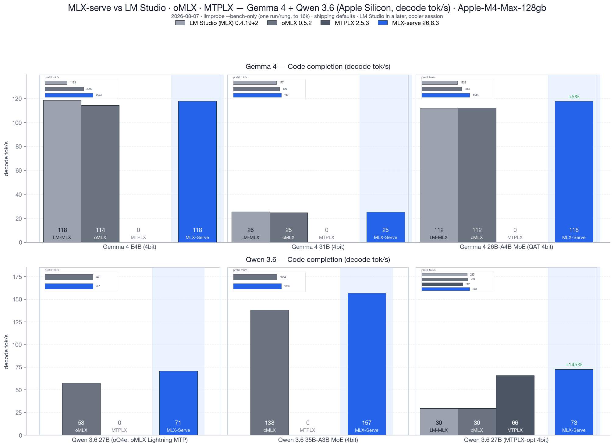
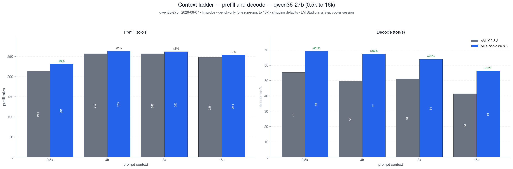

# mlx-serve — run any LLM on your Mac

**OpenAI- and Anthropic-compatible local inference for Apple Silicon — MLX *and* GGUF — faster than LM Studio on identical MLX weights. No Python. No cloud. No Electron.**

[](https://github.com/ddalcu/mlx-serve/releases/latest)
[](https://github.com/ddalcu/mlx-serve/stargazers)
[](https://github.com/ddalcu/mlx-serve/releases)
[](https://github.com/ddalcu/mlx-serve/commits/main)
[](LICENSE)
[](https://github.com/ddalcu/mlx-serve/releases/latest)
[](https://ziglang.org)
[](https://trendshift.io/repositories/43025)

**[mlxserve.com](https://mlxserve.com/)** · [Download MLX Core.app](https://github.com/ddalcu/mlx-serve/releases/latest) · [Changelog](CHANGELOG.md)

mlx-serve is a native Zig server that runs **any LLM on Apple Silicon** — MLX-format models *and* every GGUF on HuggingFace (Qwen, Llama, Mistral, Gemma, DeepSeek V4 Flash, thousands more). It exposes **OpenAI-compatible** *and* **Anthropic-compatible** HTTP APIs out of the box, so the same `http://localhost:11234` works with Claude Code, the OpenAI SDK, Continue, Cursor, Open WebUI, and anything else that speaks one of those wires. Beyond text, the same server generates **images, video, music, speech (with voice cloning), and 3D models** — all natively on MLX. Ships with **MLX Core**, a macOS menu-bar app with chat, agent mode, MCP tool calling, and model management.

## Get started

### Use the app (recommended)

**MLX Core** is a signed, notarized macOS menu-bar app that bundles the server. Browse and download models with a progress UI, chat, run agent mode with MCP tools, generate images / video / music / speech / 3D, and tune every server flag from a Settings window. No terminal, nothing to configure. The server underneath is the same binary the CLI runs, on the same `http://localhost:11234`, so Claude Code and any OpenAI or Anthropic client can point at it while the app is running.

[](https://github.com/ddalcu/mlx-serve/releases/latest) **[Download MLX Core.app](https://github.com/ddalcu/mlx-serve/releases/latest)** — latest release for macOS (Apple Silicon)

### Install via Homebrew

```bash
brew tap ddalcu/mlx-serve https://github.com/ddalcu/mlx-serve
brew install --cask mlx-core   # the app (recommended)
brew install mlx-serve         # CLI + server only, no GUI
```

### Prefer the terminal?

Ollama-style, if that's your habit:

```bash
mlx-serve run gemma4        # downloads Gemma 4 E4B (4-bit), serves it, chats right in your terminal
mlx-serve pull qwen3.6:27b  # just download (resumable, straight from Hugging Face)
mlx-serve list              # what's on disk
mlx-serve serve             # serve everything you've pulled — models load on demand by name
```

Short names, `org/repo` HuggingFace ids, and `name:tag` all work.

Or drive the server directly with flags, which is what you want for scripts, launchd, or a headless Mac:

```bash
# one model, pinned for the life of the process
mlx-serve --model ~/.mlx-serve/models/mlx-community/gemma-4-e4b-it-4bit --serve --port 11234

# a whole folder, every model loaded on demand by name
# (this is exactly what `mlx-serve serve` and the app do)
mlx-serve --serve --model-dir ~/.mlx-serve/models

# GGUF takes the same flags; the server detects it and routes to the embedded llama.cpp
mlx-serve --model ~/models/Qwen3.5-4B-Q4_K_M.gguf --serve
```

`mlx-serve --help` lists every flag. Defaults are `--host 0.0.0.0 --port 11234`.

And because mlx-serve **speaks the Ollama API** (`/api/chat`, `/api/generate`, `/api/tags`, `/api/embed`, `/api/pull`, …) alongside OpenAI and Anthropic, your existing Ollama-connected tools — Raycast, Obsidian, Enchanted, Open WebUI, `ollama-python`/`js` — work unchanged: point them at `http://localhost:11234` and keep your workflow, on a faster engine.

## Why mlx-serve


If you're already on LM Studio, Ollama, or `mlx-lm` and wondering whether to switch — here's the short version, head-to-head:

| | mlx-serve | LM Studio | Ollama | mlx-lm |
|---|:---:|:---:|:---:|:---:|
| MLX models (native Apple) | ✅ | ✅ | ❌ | ✅ |
| GGUF models (llama.cpp) | ✅ **embedded** | ✅ | ✅ | ❌ |
| OpenAI-compatible API | ✅ | ✅ | partial | ❌ |
| Anthropic Messages API | ✅ | 🟡 partial² | ❌ | ❌ |
| Ollama API (drop-in for Ollama clients) | ✅ | ❌ | ✅ native | ❌ |
| `run <model>` CLI with auto-download + REPL | ✅ | ❌ | ✅ | ❌ |
| OpenAI Responses API + WebSockets | ✅ | 🟡 partial² | ❌ | ❌ |
| DeepSeek V4 Flash (284B) | ✅ via ds4 | ❌ | ❌ | ❌ |
| Speculative decoding (PLD + drafter + native MTP) | ✅ | ❌ | partial | drafter only |
| Decode speed (geomean vs LM Studio, identical weights) | **+26%** (MLX, shipping defaults) | baseline | ~−15% (GGUF, est.¹) | +11% (MLX) |
| KV-cache quantization (4/8-bit + TurboQuant) | ✅ | ❌ | partial | ✅ |
| Continuous batching | ✅ | ❌ | ✅ | ❌ |
| Built-in agent loop + MCP client | ✅ 10 tools | ❌ | ❌ | ❌ |
| Sandboxed agent shell (isolated Linux VM) | ✅ | ❌ | ❌ | ❌ |
| LAN model sharing (use another Mac's models) | ✅ | ❌ | ❌ | ❌ |
| One-click launchers (Claude Code, OpenCode, Pi) | ✅ | ❌ | ❌ | ❌ |
| Python required at runtime | ❌ | ❌ | ❌ | ✅ |
| Native menu-bar app (no Electron) | ✅ | ❌ Electron | ❌ | ❌ |
| **Image generation + photo editing** | ✅ | ❌ | ❌ | ❌ |
| **Video generation** (text / image / audio → video) | ✅ | ❌ | ❌ | ❌ |
| **Speech + voice cloning** | ✅ | ❌ | ❌ | ❌ |
| **Music generation** | ✅ | ❌ | ❌ | ❌ |
| **3D generation** (image → textured 3D model) | ✅ | ❌ | ❌ | ❌ |
| License | MIT | proprietary | MIT | MIT |

¹ Ollama can't run MLX, so the comparison is GGUF-vs-GGUF. 
² Recent LM Studio builds ship Anthropic `/v1/messages` and OpenAI `/v1/responses` compatibility endpoints, with partial coverage of each surface — mlx-serve additionally implements e.g. the Responses WebSocket transport and `/v1/responses/compact`.

Numbers and charts in [Performance](#performance).

## Features

- **Run any LLM** — every supported MLX architecture *and* the entire GGUF universe via embedded llama.cpp. DeepSeek V4 Flash runs through the dedicated [antirez/ds4](https://github.com/antirez/ds4) engine.
- **OpenAI-compatible API** — `/v1/chat/completions`, `/v1/completions`, `/v1/embeddings`, `/v1/models`, streaming SSE, tools, JSON-schema constrained decoding, logprobs.
- **OpenAI Responses API** — `/v1/responses` with `previous_response_id` chains, per-event `sequence_number`, the `/v1/responses/compact` opaque history blob, and a WebSocket transport on the same endpoint.
- **Anthropic Messages API** — `/v1/messages` works with Claude Code (`ANTHROPIC_BASE_URL=http://localhost:11234`) and the Anthropic SDK.
- **Ollama-compatible API** — `/api/chat`, `/api/generate`, `/api/tags`, `/api/show`, `/api/ps`, `/api/embed`, `/api/pull` speak the Ollama wire (NDJSON streaming, tool calls with object arguments, `thinking`, `format` JSON schemas, `name:latest` model names), so the whole Ollama client ecosystem works against mlx-serve unchanged.
- **Ollama-grade CLI** — `mlx-serve run gemma4` downloads (resumable), serves, and drops you into a streaming chat REPL; `pull` / `list` / `serve` manage a shared `~/.mlx-serve/models` store the GUI app uses too.
- **Built-in web console** — open the server's address in a browser (http://localhost:11234 by default) and you get a chat playground against any model on the box, a live Monitor page, image generation and editing, speech and music tools, and the full API reference. Renders with no model loaded, so it works on a fresh headless box too.
- **Speculative decoding** — PLD (model-agnostic n-gram lookup, on by default) + the Gemma 4 cross-attention drafter. Adaptive prompt-time and runtime gates keep novel-content workloads at parity; agentic code loops see up to 1.6×.
- **Native multi-token prediction (Qwen 3.5/3.6)** — checkpoints shipping a trained MTP sidecar (like [Qwen3.6-27B-4bit-MTP](https://huggingface.co/ddalcu/Qwen3.6-27B-4bit-MTP-MLX-Serve), or [MTPLX](https://github.com/youssofal/MTPLX)-published artifacts, loaded unmodified) speculate with the model's own head automatically: 3 drafts per round with a self-tuning depth controller, +15–26% on coding-agent loops, MoE sidecars (35B-A3B) supported, and oMLX oQ-format checkpoints load their in-checkpoint MTP heads directly. In same-checkpoint head-to-heads on shipping defaults, mlx-serve out-decodes both reference MTP runtimes: **+10% decode and +17% prefill over MTPLX 2.5.3** on its own MTPLX-Optimized build, and **+25% to +36% decode over oMLX 0.5.2** with its Lightning MTP at every ladder rung from 0.5K to 16K on oMLX's own oQ4e checkpoint.
- **Long-context prefill that flies** — a custom flash-attention Metal kernel handles Gemma's sliding-window layers during prefill, skipping everything outside the attention window: 2.4× prefill (299 → 715 tok/s) on a ~100K-token prompt with *less* peak memory. Qwen 3.5/3.6 long prompts prefill in architecture-tuned chunks: ~5% faster with peak memory down ~9 GB on the 27B.
- **KV-cache quantization** — 4-bit / 8-bit / TurboQuant variants shrink KV memory ~4× / ~2× / further still, so 16K contexts fit on hardware that couldn't hold them dense.
- **Continuous batching** — `--max-concurrent N` batches decode requests through one forward pass for ~1.6× throughput at 4-way parallel.
- **LAN model sharing** — `--lan-share all` lets other Macs on your network run inference on this Mac's models; `--lan-discover` mirrors peers' models into `/v1/models` as `model@peer` and proxies requests transparently, so Claude Code on a MacBook chats with the Studio's 27B through plain `localhost`. Off by default, zero configuration (Bonjour), share list enforced server-side, and only inference is ever exposed.
- **Prefix cache** — shared system-prompt KV reuse across turns and across conversations. v26.5.7 adds an LRU of llama.cpp KV sessions so multi-doc agent loops stay warm.
- **Tokenize cache** — chat-template render + tokenize cached per request; the second hit on a long conversation is a memcpy. Warm TTFT 7.7× faster on 1.8K-token prompts.
- **Vision** — Gemma 4 SigLIP and Qwen3-VL encoders; send images via `image_url` content blocks.
- **Logprobs** — `logprobs` / `top_logprobs` on chat, and the legacy integer shape on `/v1/completions`, streaming and not. Pre-temperature, ids travel with values, and the entry belongs to the token that was actually returned.
- **Reasoning / thinking** — full streaming of thinking tokens as `reasoning_content`.
- **No Python** — single Zig binary, no `pip`, no venv. The MLX Core app ships everything signed and notarized.

## MLX Core (macOS App)

Menu-bar app that wraps the server with a full UI:

- **Model browser** — download from HuggingFace with resumable multi-connection transfers (up to 16 connections per file), auto-discovers LM Studio's existing model folder (`~/.lmstudio/settings.json`) so you don't re-download what's on disk, GGUF rows show a min–max RAM-estimate range.
- **Chat interface** — multi-session chat with markdown rendering. Drop in PDFs (PDFKit-extracted) or images alongside text.
- **Agent mode** — 10 built-in tools (shell, cwd, readFile, writeFile, editFile, searchFiles, listFiles, browse, webSearch, saveMemory) with automatic tool calling loop and a per-tool approval dialog (**Allow** / **Deny** / **Always allow this session**).
- **Agents** — named assistants with their own personality, voice, model, tools, workspace and wake phrase. The app writes the persona prompt for you, and every way of starting a conversation can run as one: chat tabs, hands-free voice, scheduled tasks, Telegram, the Quick Launcher.
- **MCP client** — curated marketplace of stdio + HTTP MCP servers (GitHub, Azure DevOps, DBHub, Docker, Kubernetes, Playwright, Slack, Notion, Filesystem, Shell) plus your own from `~/.mlx-serve/mcp.json`.
- **Agent Sandbox** — flip one toggle and every agent shell command runs inside an isolated Linux VM built on Apple's Virtualization framework: boots in under a second, guest servers mirror to `localhost` live (an Express app on guest port 8080 is `http://localhost:8080` on your Mac), and a green shield in the toolbar shows when commands run isolated. Let the agent go wild — your Mac stays untouched.
- **⌃Space Quick Launcher** — a Spotlight-style prompt panel over any app: hit ⌃Space, ask, and the answer streams in from your local model. Follow-ups keep context; ⌘↩ hands the conversation off to the full chat window.
- **Hands-free Voice Mode** — say "Hey Loki" and just talk: on-device speech recognition (audio never leaves the Mac), spoken replies with barge-in interruption, and voice-driven agent tools — all from the menu bar with no window open. Replies speak in your pick of 54 built-in Kokoro voices (fully local, ~17× realtime, a 345 MB download, blendable) or a Qwen3-TTS clone of your own voice.
- **LAN Sharing** — share chosen models with the other Macs in your house and use theirs: peers appear automatically, shared models show up in the tray and every generation pane as "model · peer", and requests stream to the Mac that hosts the weights — chat, image, speech, music, video, and 3D alike, with models loading on demand on the host. Per-model share checkboxes in Settings; prompts sent to a shared model run on (and are visible to) the hosting Mac.
- **Telegram bridge** — message your local model from your phone: no public URL, no port-forwarding, no cloud relay. Agent tools and scheduled tasks work remotely; the bot locks to the first chat that messages it.
- **Scheduled tasks** — hand the agent a goal and a schedule in plain English ("weekdays at 8am, check my watched sites and write a briefing") and it runs unattended, with saved transcripts.
- **Document folder RAG** — attach a folder of mixed files and ask questions about them; GPU-batched embeddings index ~500 files in ~7 s, everything in memory, nothing leaves the Mac.
- **Editable system prompt + persistent memory** — `~/.mlx-serve/system-prompt.md` and `~/.mlx-serve/memory.md`.
- **Prompt-based skills** — drop `.md` files into `~/.mlx-serve/skills/` with YAML frontmatter to teach the agent custom capabilities triggered by keywords.
- **Engine-aware Settings window** (Cmd+,) — every server-launch flag and per-request default, with sections that show only the knobs relevant to the engine you've loaded (MLX vs GGUF vs ds4).
- **Server management** — start/stop, live log buffer, restart-on-flag-change banner.
- **Image / Video / Music / Speech / 3D generation** — FLUX.2, Krea-2, Mage-Flow, LTX-Video 2.3, MiniMax-H3, ACE-Step, Qwen3-TTS, Kokoro and Hunyuan3D, all native via the mlx-serve zig server.

### Image / Video / Music / Speech / 3D Generation

One server, five modalities — the tray has **ImageGen**, **VideoGen**, **AudioGen** (speech + music) and **3D** panels that run [FLUX.2](https://huggingface.co/black-forest-labs) / Krea-2 / Microsoft Mage-Flow, [LTX-Video 2.3](https://github.com/dgrauet/ltx-2-mlx) / [MiniMax-H3](https://huggingface.co/ddalcu/MiniMax-H3-FL2VA-MLX-Serve-8bit), [ACE-Step 1.5](https://huggingface.co/ddalcu/ACE-Step-1.5-XL-Turbo-MLX-Serve-8bit), [Qwen3-TTS](https://huggingface.co/Qwen/Qwen3-TTS-12Hz-1.7B-Base) / [Kokoro-82M](https://huggingface.co/ddalcu/Kokoro-82M-MLX-Serve), and [Hunyuan3D-2.1](https://huggingface.co/ddalcu/Hunyuan3D-2.1-MLX-Serve-8bit) natively on MLX. Click a panel, hit **Download**, generate. Each panel remembers your last-used model, quality, resolution, steps and seed between sessions.

You can also **generate media straight from chat**: ask for an image, a spoken line, a music track or a short clip and it renders inline in the conversation with a progress bar, using your saved settings for that modality. Attach a photo and say "make it winter" and the edit comes back in the same thread. Double-click any chat image to open it full-size in Preview.

And it goes well beyond text-to-X:

- **Edit photos with instructions** — attach a picture, type *"make the hair blue"* or *"remove the monitor in the background"*, and FLUX.2-klein or Mage-Flow Edit changes it while keeping subject, pose, and scene intact (in-context reference conditioning — 0.97 structural correlation measured live). Mage-Flow Edit also composes multiple references ("put the object from image 2 into image 1") and does control maps, restoration and relighting from plain instructions. The source keeps its own aspect ratio, never squished. Works from the OpenAI SDK too: `client.images.edit(image=…, prompt=…)` against `POST /v1/images/edits`.
- **Image-to-image variations** — every image model (Krea-2 included) takes a source image plus a strength slider, from subtle remix to full re-imagination.
- **Animate your photos** — drop a picture into the Video pane's First-frame slot and LTX animates forward from it, starting exactly on your image.
- **Talking characters** — put spoken lines in quotes in the video prompt, attach a real speech or music clip, or type a line for Qwen3-TTS to voice — the video is generated *against* that soundtrack, performance synced, and the original audio (not a re-synthesis) lands in the mp4.
- **Clone a voice from seconds of audio** — record or pick a clip in Settings ▸ Voice and Qwen3-TTS speaks in that voice — in the AudioGen panel, in hands-free Voice Mode, everywhere.
- **Compose full music tracks** — ACE-Step 1.5 turns a style prompt (and optional lyrics) into a 48 kHz stereo track: a 30-second song renders in about 4 seconds.
- **Turn a photo into a 3D model** — Hunyuan3D-2.1 converts an image into a watertight GLB mesh, optionally with full PBR textures — drops straight into a game engine or slicer.
- **Video with its own soundtrack** — MiniMax-H3 (Hailuo 3.0) denoises the clip and a stereo soundtrack together in one pass, so the sound is produced with the video rather than dubbed on after. Describe the scene, then what you want to hear after `overall_soundscape:`. The REF2VA build builds the clip around pictures, clips or audio you attach (`<Picture 1>`, `<Video 1>`, `<Audio 1>` in the prompt); the FL2VA build takes first/last keyframes and chains windows into longer clips. **Turbo** renders in 4 steps instead of 30. It is slow either way: 1344×768 at 124 frames is about 50 minutes on an M4 Max.
- **Style LoRAs** — attach diffusers, kohya or PEFT `.safetensors` adapters to restyle FLUX, Krea, Mage-Flow, LTX or MiniMax-H3 generations at runtime. Up to 8 at once, summed rather than merged, so nothing is re-quantized and there is zero quality loss on the base weights. Each adapter runs at the strength its own file declares.

**Models:**

| Feature | Default | Other options | Approx. RAM |
|---|---|---|---|
| Image | FLUX.2-klein 4B 4-bit (mflux, ~5 GB pre-quantized) | FLUX.2-klein 9B (10 GB), Krea-2-Turbo, Mage-Flow Turbo / Edit 8-bit (8.5 / 9.1 GB) | 8 / 12 / 16 GB |
| Video | LTX-Video 2.3 Q4 | MiniMax-H3 (Hailuo 3.0) 4-bit / 8-bit, video **and** matching soundtrack in one pass | LTX 24 GB RAM (~50 GB download); H3 26 GB (40 GB) or 44 GB (69 GB) |
| Speech | Qwen3-TTS 1.7b (voice cloning) | Qwen3-TTS 0.6b, Kokoro-82M (54 voices, ~345 MB) | 8 GB RAM, ~3.5 GB first-run download |
| Music | ACE-Step 1.5 XL Turbo 8-bit | — | 8 GB RAM, ~6.2 GB first-run download |
| 3D | Hunyuan3D-2.1 8-bit (shape + PBR texture) | — | 16 GB RAM |

> The 41 GB LTX snapshot ships **both** transformer variants (1-stage distilled + 2-stage dev, ~11 GB each) plus a 7.6 GB distillation LoRA, so you can switch between Fast/Good/Quality/Super offline without re-downloading.

Outputs go to `~/.mlx-serve/generations/` under per-modality, per-date folders.

> The app won't let you start a generation if there isn't enough free RAM. If the mlx-serve server is running and competing for memory, you'll be prompted to stop it first.

## Supported Models

| Architecture | `model_type` | Examples | Chat Format | Vision |
|---|---|---|---|---|
| **Gemma 4** | `gemma4`, `gemma4_unified` | `gemma-4-e2b-it-4bit`, `gemma-4-e4b-it-8bit`, `gemma-4-26b-a4b-it-4bit`, `gemma-4-12b-unified` | Gemma turns | SigLIP (unified adds audio) |
| **Gemma 3** | `gemma3` | `gemma-3-12b-it-qat-4bit` | Gemma turns | -- |
| **DiffusionGemma** | `diffusion_gemma` | `diffusiongemma-26B-A4B-it-4bit` | Gemma turns (block diffusion) | -- |
| **Qwen 2 / 3 / 3.5 / 3.6** | `qwen2`, `qwen3`, `qwen3_moe`, `qwen3_5`, `qwen3_5_moe`, `qwen3_next` | `Qwen3-4B`, `Qwen3.5-4B`, `Qwen3.6-27B`, `Qwen3.6-35B-A3B` | ChatML | Qwen3-VL |
| **DeepSeek V4 Flash** | `deepseek_v4` | DeepSeek-V4-Flash-0731 (284B-A13B, 1M ctx) — **native MLX** for safetensors builds, embedded [ds4](https://github.com/antirez/ds4) for `.gguf` | DSV4 + DSML tools | -- |
| **Inkling Small** | `inkling_mm_model` | Thinking Machines Inkling Small (276B-A12B MoE, 2-bit) | role-less channel messages | -- |
| **Hunyuan 3** | `hy_v3` | `Hy3-295B-Instruct` (295B-A21B MoE, 2-bit) | Hunyuan tags | -- |
| **Laguna** | `laguna` | poolside Laguna S 2.1 / XS (117.6B-A8.5B MoE coder, nvfp4) | GLM tags, pre-opened think | -- |
| **Nemotron-H** | `nemotron_h` | Nemotron-3-Nano-4B | ChatML | -- |
| **LFM2 / LFM2.5** | `lfm2` | LFM2.5-2.6B (8-bit, bf16, nvfp4, mxfp4) | ChatML, Pythonic tool calls | -- |
| **Llama** | `llama` | Llama 3, Llama 3.1, Llama 3.2 | Llama-3 | -- |
| **Mistral** | `mistral` | Mistral 7B Instruct v0.3 | Mistral turns | -- |
| **Embeddings** | `bert`, `gemma3_text`, `qwen3` | bge, mxbai, EmbeddingGemma, Qwen3-Embedding (pooling read from the checkpoint) | n/a | -- |
| **Anything else as GGUF** | via embedded llama.cpp | any `.gguf` on HuggingFace | per-template | -- |

Media models live in the same registry and are classified the same way: FLUX.2, Krea-2 and Mage-Flow (image), Qwen3-TTS, Kokoro and ACE-Step (speech + music), LTX-Video and MiniMax-H3 (video), Hunyuan3D-2.1 (3D). A chat request naming one of them gets a 400 that names the endpoint to use instead.

Any quantized MLX model using one of the above architectures works natively. Anything else can be served as GGUF through the embedded llama.cpp engine — just pick the `.gguf` file in the Model Browser and the server auto-routes by format. Models with unsupported architectures are flagged in the Model Browser but can still be downloaded.

## Prerequisites

- macOS 26.2+ with Apple Silicon (M1/M2/M3/M4/M5) — the bundled MLX is built at deployment target 26.2 so the M5 neural-accelerator (NAX) kernels ship enabled
- [Zig 0.17 nightly](https://ziglang.org/download/) *(only if building from source — staged automatically by `./scripts/fetch-zig.sh` into `.zig-toolchain/`)*
- libwebp *(only if building from source)*: `brew install webp`
- Xcode 26.2+ with the Metal Toolchain component *(only if building from source — mlx + mlx-c are pinned submodules compiled by `scripts/build-mlx.sh`, not brew packages, so the NAX kernels the brew bottle silently omits are included)*

## Build from source

You only need this if you're hacking on mlx-serve. To just use it, grab the app or `brew install` above.

One script builds everything, app and server:

```bash
git clone --recurse-submodules https://github.com/ddalcu/mlx-serve && cd mlx-serve
APPLE_DEVELOPER_ID=- APPLE_TEAM_ID=- SKIP_NOTARIZE=1 ./app/build.sh
open "app/MLX Core.app"
```

`app/build.sh` snaps the pinned submodules back to their commits, stages llama.cpp and the Zig nightly, builds mlx + mlx-c with NAX kernels asserted, compiles the Swift app and the Zig server, then bundles and signs. `APPLE_DEVELOPER_ID=-` picks ad-hoc signing, so no Apple developer account is needed. A notarized release build wants a real identity plus `APPLE_ID` and `APPLE_ID_PASSWORD`.

Server only, skipping the app:

```bash
./scripts/fetch-llama.sh && ./scripts/build-mlx.sh   # once, and again on a pin bump
zig build -Doptimize=ReleaseFast                     # always ReleaseFast; Debug is 2-4x slower
```

## Usage

Serving is covered in [Get started](#prefer-the-terminal). One-shot, without a server:

```bash
mlx-serve --model /path/to/model --prompt "What is 2+2?"
```

### CLI options

| Flag | Default | Description |
|---|---|---|
| `--model PATH` | required | Path to the model directory or a `.gguf` file |
| `--serve` | off | Start the HTTP server |
| `--host ADDR` | `0.0.0.0` | Bind address (all interfaces — set `127.0.0.1` for strictly local) |
| `--port N` | `11234` | Port for the HTTP server |
| `--prompt TEXT` | `"Hello"` | Prompt for interactive mode |
| `--max-tokens N` | `100` | Maximum tokens to generate |
| `--temp F` | `0.0` | Sampling temperature (0 = greedy) |
| `--ctx-size N` | auto | Context window size (auto = computed from GPU memory) |
| `--embedding-max-length N` | auto | Per-input token ceiling for `/v1/embeddings` (auto = the model's declared window; over-limit inputs get a 400, never silent truncation) |
| `--timeout N` | `300` | Stall timeout — seconds *without a new token* (a request that keeps producing never times out) |
| `--reasoning-budget N` | `-1` | Thinking token budget (`-1` = unlimited, `0` = no thinking) |
| `--no-vision` | off | Disable vision encoder even if model supports it |
| `--pld` / `--no-pld` | on | Prompt Lookup Decoding (model-agnostic spec-decode) |
| `--pld-draft-len N` | `5` | Max draft tokens per PLD step |
| `--pld-key-len N` | `3` | N-gram match key length for PLD |
| `--drafter DIR` | none | Gemma 4 assistant drafter checkpoint (e.g. `gemma-4-E4B-it-assistant-bf16`) |
| `--draft-block-size N` | `4` | Drafts per round for the Gemma 4 drafter |
| `--no-mtp` / `--mtp` | on when sidecar present | Disable / force the native MTP head (MoE trunks default off) |
| `--mtp-depth N` | `3` | Max tokens drafted per MTP round (adaptive controller tunes within `[1, N]`) |
| `--dspark` | off | DeepSeek V4's own block-parallel draft stages (~11 GB on top of the model) |
| `--no-decode-attn-quant` | on | Disable the decode-only requant of dense bf16 attention weights (the "Fast decode for bf16-attention models" toggle) |
| `--kv-quant {off,4,8,turbo2,turbo4}` | off | KV-cache quantization scheme (MLX path) |
| `--kv-attn-mode {auto,dense,fused}` | auto | Decode read path for quantized KV: `fused` reads the packed cache in place, `auto` engages it from 8K prompt tokens (only at `--kv-quant 4/8`; per-request `kv_attn_mode` overrides) |
| `--llama-kv-quant {off,q8,q4}` | off | KV-cache quantization for GGUF (llama.cpp path) |
| `--llama-cache-entries N` | `4` | Multi-session LRU for llama.cpp (warm multi-doc agents) |
| `--tokenize-cache-entries N` | `4` | Chat-template + tokenize cache size |
| `--max-concurrent N` | `1` | Continuous-batch decode parallelism |
| `--prefix-cache-entries N` | auto | Shared-prefix KV cache entry cap |
| `--prefix-cache-mem N{KB,MB,GB}` | `2 GB` | Shared-prefix KV cache memory cap |
| `--prefix-cache-disk N{MB,GB}` | off | SSD tier: prefixes survive restarts (11K-token restart TTFT 5.9 s → 0.7 s) |
| `--metrics` | off | Prometheus `/metrics` + live dashboard panel on `/` |
| `--api-key KEY` | none | Require a key for non-localhost requests (localhost stays open) |
| `--lan-share <all\|id,...>` | off | Share the listed models (or all) with your local network over Bonjour — only inference is exposed, model management stays host-local |
| `--lan-discover` | off | Discover models other Macs share: they appear in `/v1/models` as `model@peer` and requests proxy to that Mac |
| `--lan-name NAME` | hostname | The Bonjour name other Macs see |
| `--model-dir PATH` | none | Discover and serve every model in a folder (LRU resident set). Repeatable — folders merge first-wins |
| `--max-resident-mem N{MB,GB}` | auto | Summed memory cap across loaded models; decides whether a model may load at all (auto = 80% of the MLX wired limit, `0` disables) |
| `--max-resident-models N` | `3` | How many models stay loaded at once (LRU-evicted) |
| `--skip-mem-preflight` | off | Skip the free-RAM pre-flight on load (the cap above is checked first, and still applies) |
| `--no-tool-autocorrect` | off | Turn off schema-driven repair of model-emitted tool arguments |
| `--log-level` | `info` | Log level (error, warn, info, debug) |
| `--log-file PATH` | `~/.mlx-serve/logs/` | Where the server log goes |

## API

### POST /v1/chat/completions

```bash
curl http://localhost:11234/v1/chat/completions \
  -H "Content-Type: application/json" \
  -d '{
    "messages": [{"role": "user", "content": "Write a haiku about programming."}],
    "max_tokens": 256,
    "stream": true
  }'
```

Supports `messages`, `max_tokens`, `temperature`, `top_p`, `top_k`, `stream`, `stream_options`, `tools`, `response_format`, `repetition_penalty`, `presence_penalty`, `logprobs` / `top_logprobs`, `reasoning_effort` / `enable_thinking` / `reasoning_budget_tokens`, plus per-request `kv_quant` and `kv_attn_mode` overrides. Messages can include `image_url` content blocks (base64 or URL) for vision-capable models. Usage always carries `prompt_tokens_details.cached_tokens`, and a reply cut short because the model went in circles reports `finish_details: {"type": "repetition_loop"}` beside `finish_reason`.

### POST /v1/messages (Anthropic)

```bash
curl http://localhost:11234/v1/messages \
  -H "Content-Type: application/json" \
  -H "anthropic-version: 2023-06-01" \
  -d '{
    "model": "mlx-serve",
    "max_tokens": 256,
    "messages": [{"role": "user", "content": "Write a haiku about programming."}]
  }'
```

Compatible with Claude Code (`ANTHROPIC_BASE_URL=http://localhost:11234 claude`) and Anthropic SDKs. Supports streaming, tool calling, and extended thinking.

### POST /v1/responses (OpenAI Responses API)

```bash
curl http://localhost:11234/v1/responses \
  -H "Content-Type: application/json" \
  -d '{
    "model": "mlx-serve",
    "input": "Write a haiku about programming.",
    "stream": true
  }'
```

Stateful chains via `previous_response_id`, full streaming SSE with per-event `sequence_number`, schema-conformant envelope with `tools` / `tool_choice` / `text` / `reasoning` / `usage` echo. `POST /v1/responses/compact` returns an opaque base64 history blob that round-trips back as a `compaction` input item without any LLM call. Same endpoint also accepts an `Upgrade: websocket` handshake — each text frame is a `response.create` JSON message, and each SSE event becomes one outbound text frame.

### Other endpoints

- `GET /` — built-in web console: chat playground, Monitor, image and audio tools, API reference
- `GET /health` — health check
- `GET /v1/models` — list loaded models with capabilities + engine info
- `POST /v1/completions` — text completions
- `POST /v1/embeddings` — text embeddings (BERT, EmbeddingGemma, and last-token pooling models like Qwen3-Embedding; pooling follows the checkpoint's sentence-transformers metadata, `dimensions` truncates and renormalizes)
- `POST /v1/images/generations`, `POST /v1/images/edits` — image generation and instruction edits; the edits endpoint speaks the OpenAI SDK's multipart shape (`client.images.edit`), including repeated `image[]` for multi-reference
- `POST /v1/audio/speech` — Qwen3-TTS (`ref_audio` clones a voice) or Kokoro (`voice` picks or blends one of 54), WAV out
- `POST /v1/audio/music-generations` — ACE-Step text-to-music, 48 kHz stereo WAV
- `POST /v1/video/generations` — LTX-Video or MiniMax-H3; base64 `rgb8` frames plus `pcm_s16le` audio, mux on your side
- `POST /v1/3d/generations` — Hunyuan3D-2.1, base64 GLB
- `POST /v1/load-model`, `POST /v1/unload-model` — load a discovered model (or one by absolute path), free one now
- `POST /tokenize`, `POST /detokenize`, `GET /props` — tokenizer round-trip and llama.cpp-style server props
- `GET /metrics`, `GET /metrics.json` — Prometheus + JSON (needs `--metrics`)
- `GET /v1/responses/{id}`, `DELETE /v1/responses/{id}` — fetch / delete stored responses

Every media endpoint takes `"stream": true` for SSE progress ending in a base64 `complete` payload. Media LoRAs use one grammar everywhere: `lora_paths` + `lora_scales`, up to 8, stacked.

## Performance

Apple M4 Max, identical weights per engine. Both charts are regenerated per release by `tests/bench.sh`, which boots each engine in turn and lets [llmprobe](https://github.com/ddalcu/llmprobe) take the numbers: warmup discarded, median of three, same protocol for everyone. CSVs live in [`docs/perf-csvs/`](docs/perf-csvs/), and [benchmarks.md](benchmarks.md) tracks decode speed release by release. Every engine's version is recorded in the CSV and printed in the chart legend, so a number here always says which build it beat.



*Code completion decode tok/s, v26.8.3, against LM Studio 0.4.19+2, oMLX 0.5.2 and MTPLX 2.5.3. Every bar is that engine on its **shipping defaults** — llmprobe measures the server that is running, so there is no best-config collapse and no per-model tuning. All four engines load the identical MLX weight files. MTPLX shows 0 where it can't run (it needs its own MTP artifacts), and LM Studio is absent on two rows it has no copy of. Geomean decode: **+26% over LM Studio** across the four shared models and **+25% over oMLX** across all six, with prefill +36% and +10%. The two head-to-heads that matter are on the competitors' own checkpoints: **+23% decode over oMLX** on its oQ4e (prefill level), and **+10% decode / +17% prefill over MTPLX** on its own MTPLX-Optimized build. The bench is `./tests/bench.sh --family all --lmstudio --omlx --mtplx`.*



*Same-checkpoint head-to-head, coding-agent prompts, fresh boots, cold prompts. Against oMLX 0.5.2 running its native Lightning MTP on its own oQ4e checkpoint, mlx-serve decodes **25–36% faster at every rung** from 0.5K to 16K, with prefill ahead at all four (+2% to +8%). Both engines speculate with the checkpoint's own MTP head, so this is engine against engine on identical weights. The ladder reaches 64K under `--full`; this release shipped the default depth.*

### Speculative decoding

Three flavors, all greedy-equivalent (byte-identical at temp=0 within the first 30 tokens; mathematically exact at temp > 0 via the Leviathan probability-ratio sampler):

- **Native MTP** (Qwen 3.5/3.6) — checkpoints with a trained multi-token-prediction sidecar draft with the model's *own* head, with a controller that self-tunes depth per request. MoE sidecars supported. Auto-loads, zero setup.
- **PLD** (Prompt Lookup Decoding) — model-agnostic n-gram match in `prompt + generated_tokens`. Default-on, no per-model setup. Wins on agent loops, RAG and code editing, anywhere the answer echoes the prompt.
- **Gemma 4 assistant drafter** — Google's small 4-layer cross-attention drafters, opt-in via `--drafter <dir>`. Cross-attends into the target's KV cache, so no weights are duplicated.

All three share an **adaptive prompt-time gate**: a 3-gram repetition score auto-disables speculation on novel content, so creative writing and one-shot Q&A run at parity instead of paying verify overhead. A **runtime acceptance gate** disables speculation mid-decode if per-draft acceptance falls below break-even, sticky for the rest of the request. Both apply across all four API surfaces, streaming and non-streaming, including requests with tools. Agentic tool loops are speculative decoding's best workload.

### Tuning

The defaults are already the fast path. **If you have plenty of RAM, the fastest configuration is the one you get out of the box.** Every speed-relevant knob is a memory-for-speed trade in one direction or the other.

| Knob (CLI flag / Settings) | Default | What it does to speed | Flip it when… |
|---|---|---|---|
| **KV cache quantization** (`--kv-quant`) | off | ≈ **−10% decode** at 2–4K context; at long context the fused packed reads (auto from 8K) cut the penalty to ≈ −18% at 42K (was −47%). Saves 2× (8-bit) / 4× (4-bit) KV RAM. | …memory is the constraint: long contexts or big models on a 16 GB Mac. |
| **PLD** (`--pld`) | on | Large wins on agent loops, code editing and RAG. Auto-gates itself off on novel prose. | Leave on. `--no-pld` only for apples-to-apples benchmarks. |
| **Sampling** (`temperature` / `top_p` / `top_k`) | model defaults | Full sampling costs **~6% decode** vs greedy. | Temp 0 for benchmarks; keep sampling for chat quality. |
| **Continuous batching** (`--max-concurrent`) | 1 | ~1.6× *total* throughput at 4-way on dense models, at some per-request latency cost. | …several clients share the server. |
| **Prefix cache** (`--prefix-cache-entries/-mem`) | on | Repeated system prompts and multi-turn chats skip re-prefill. | Leave on. Cap entries on RAM-tight Macs (the app does this automatically). |
| **Native MTP** (auto when the checkpoint ships a sidecar) | on | Large gains on code and coding-agent loops. | Leave on. `--no-mtp` for benchmarks; per-request `enable_mtp` opts MoE trunks in. |
| **Drafter** (`--drafter`) | auto in the app | Big gains on Gemma 4 dense code-edit loops (+52% on E4B code, 117 → 178 tok/s). The app downloads and pairs the drafter with dense Gemma 4 models by itself; on the CLI it stays opt-in. | Leave on. The Settings toggle turns auto-pairing off. |
| **Fast decode for bf16-attention models** (`--no-decode-attn-quant` to disable) | on | Serves dense bf16 attention weights through a decode-only quantized copy: −23% per-token time on models that ship bf16 attention (poolside Laguna). Prefill keeps the dense weights. Can vary output wording slightly on those models; quantized checkpoints are unaffected. | …you want output on such a model to match the fully dense path byte for byte. |

Building from source? **Always `zig build -Doptimize=ReleaseFast`.** A bare `zig build` produces a Debug binary that's 2–4× slower and looks like a regression.


## FAQ

<details>
<summary><b>Is mlx-serve faster than LM Studio?</b></summary>

Yes, though it depends what you run. On the v26.8.3 matrix (M4 Max, LM Studio 0.4.19+2, identical MLX weight files, **both engines on shipping defaults**), mlx-serve decodes **+26% geomean** and prefills **+36% geomean** across the four models LM Studio also has.

The shape matters more than the average. On dense Gemma, raw single-stream decode is now a wash (−0.5% on E4B, −0.8% on 31B) — LM Studio has caught up there. The separation is prefill, which is +117% on E4B and +35% on the 26B-A4B MoE, and speculative decoding: on Qwen 3.6 27B mlx-serve loads the checkpoint's MTP head and LM Studio does not, which is **+145%** decode on the same file. Earlier releases quoted a larger geomean by picking the best speculative configuration per model; this one is defaults against defaults, which is the number you actually get.

</details>

<details>
<summary><b>Does mlx-serve replace LM Studio?</b></summary>

For most use cases, yes. mlx-serve runs the same MLX and GGUF models, exposes an OpenAI-compatible API on the same kind of port, and ships a native menu-bar app instead of an Electron one. It goes deeper on the API surface than LM Studio's newer compatibility endpoints — fuller Anthropic Messages and OpenAI Responses coverage, plus a WebSocket transport and response compaction — and adds things LM Studio doesn't have: MCP tool calling, agent mode with 10 built-in tools, KV-cache quantization, continuous batching, and the [antirez/ds4](https://github.com/antirez/ds4) engine for DeepSeek V4 Flash.

</details>

<details>
<summary><b>Does mlx-serve replace Ollama?</b></summary>

On Apple Silicon, yes — mlx-serve **speaks the Ollama API natively** (`/api/chat`, `/api/generate`, `/api/tags`, `/api/embed`, `/api/pull`, …), so Raycast, Obsidian, Enchanted, Open WebUI, and `ollama-python`/`js` work unchanged: drop in `http://localhost:11234` wherever you had `http://localhost:11434`. The CLI workflow matches too (`mlx-serve run gemma4`, `pull`, `list`, `serve`). Underneath, you get llama.cpp **and** native MLX with the Mac-specific optimizations Ollama doesn't ship (Metal kernels through mlx-c, speculative decoding, shared-prefix KV cache, the Gemma 4 cross-attention drafter).

</details>

<details>
<summary><b>Can I run GGUF models on my Mac without Python?</b></summary>

Yes. mlx-serve embeds llama.cpp's inference library (`libllama`) inside the same signed, notarized binary. Point `--model` at any `.gguf` and the server auto-detects the format and routes to the right engine — no `pip`, no venv, no `llama-server` to install separately. DeepSeek V4 Flash GGUFs go through the dedicated [antirez/ds4](https://github.com/antirez/ds4) engine instead, also embedded.

</details>

<details>
<summary><b>Does mlx-serve work with Claude Code?</b></summary>

Yes — natively. mlx-serve implements Anthropic's `/v1/messages` endpoint including streaming, tool calling, and extended thinking. Point Claude Code at it with `ANTHROPIC_BASE_URL=http://localhost:11234`. The MLX Core app ships a one-click "Launch Claude Code" button that wires up the env vars for you.

</details>

<details>
<summary><b>Can my Macs share models over the network?</b></summary>

Yes — LAN Sharing, off by default. Turn on sharing where the models live (Settings ▸ LAN Sharing, or `mlx-serve --serve --lan-share all`) and discovery on the Mac that wants to use them (`--lan-discover`). They find each other over Bonjour — no IPs, no config — and shared models appear in every model picker as "model · peer" and in `/v1/models` as `model@peer`, so even Claude Code pointed at `localhost` can run on the other Mac's model. Works for chat and image/speech/music/video/3D generation; models cold-load on demand on the host; only inference is exposed (model management, metrics, and the status page stay private to each Mac).

</details>

<details>
<summary><b>What about the OpenAI SDK, Continue, Cursor, Open WebUI?</b></summary>

All work — anything that talks the OpenAI chat-completions or Anthropic Messages wire protocol does. mlx-serve also implements the newer OpenAI Responses API (`/v1/responses`) for clients that want stateful chains via `previous_response_id`, plus a WebSocket transport on the same endpoint.

</details>

<details>
<summary><b>Can mlx-serve run DeepSeek V4 Flash locally?</b></summary>

Yes, on 128 GB+ Apple Silicon Macs. Open the MLX Core Model Browser, pick DeepSeek-V4-Flash, hit Download. Since v26.7.12 the safetensors build runs on our own MLX engine rather than through GGUF: 284B with 13B active, 1M context, chat, thinking, tool calls and streaming, about 30 tok/s serial decode on an M4 Max and roughly twice that with DSpark (`--dspark`, the checkpoint's own draft stages). `.gguf` builds still route to the embedded [ds4](https://github.com/antirez/ds4) engine. Agent mode and MCP tools work on DSV4 too. It needs the 0731 release of the checkpoint; the earlier preview is turned away at load.

</details>

<details>
<summary><b>What models are supported?</b></summary>

Native MLX dispatch for Gemma 3/4, DiffusionGemma, Qwen 3 / 3.5 / 3.6 / 3-Next, Tencent Hunyuan 3 (295B), Thinking Machines Inkling Small (276B), poolside Laguna S 2.1, Llama 3.x, Mistral, Nemotron-H, LFM2.5, and DeepSeek V4 Flash. Anything else as GGUF via embedded llama.cpp — Qwen, Llama, Mistral, Gemma, DeepSeek, Phi, Yi, and thousands more available on HuggingFace.

</details>

<details>
<summary><b>Can mlx-serve run Tencent's Hunyuan 3 (295B) locally?</b></summary>

Yes — the largest open model mlx-serve runs. The 2-bit mixed-precision build (`mlx-serve run hy3`, ~105 GB on disk) decodes at ~26 tok/s with ~235 tok/s prefill on an M4 Max, with thinking, tool calling, and all four API surfaces working. It's recommended for Macs with **more than 128 GB** of unified memory; on a 128 GB Mac it loads and answers correctly, but only a minimal context window (~3K tokens) fits beside the weights — fine for short chats, tight for agent work. The checkpoint's native multi-token-prediction head is supported too (`enable_mtp: true` per request, best with `--mtp-depth 1`).

</details>

<details>
<summary><b>How does it compare to MTPLX for Qwen MTP models?</b></summary>

[MTPLX](https://github.com/youssofal/MTPLX) is a focused Python runtime built around Qwen's native multi-token-prediction heads, and it set the bar here. mlx-serve loads the same MTP sidecar artifacts (including MTPLX-published ones) with zero setup and, in a same-machine head-to-head on the identical checkpoint, prompts, and sampling (v26.8.3 vs MTPLX 2.5.3, both on shipping defaults), decodes **+10%** faster with **+17%** prefill and a third of the time to first token (494 ms vs 1528 ms). You also get the rest of the stack — OpenAI/Anthropic/Ollama APIs, GGUF, the agent app — in one binary with no Python.

</details>

<details>
<summary><b>Does it support tools / function calling?</b></summary>

Yes, on both API surfaces. The server detects tool-call patterns across architectures (Hermes XML, Gemma 4 `<|tool_call>`, raw JSON, ChatML), repairs common Qwen 3.5/3.6 escape quirks, and emits OpenAI-style `tool_calls` deltas in the SSE stream. The MLX Core app ships 10 built-in tools (shell, file I/O, search, browse, web search, memory) and connects to MCP servers from a curated marketplace.

</details>

<details>
<summary><b>How does it stay this small / fast?</b></summary>

Zig with direct `mlx-c` FFI — no Python runtime, no Electron, no IPC bridge. The release binary is ~7 MB. Eager warmup at boot page-faults weights and pre-compiles decode kernels (first request 3.5× faster). Multi-turn agent loops reuse KV across turns and skip re-prefilling system prompts via a shared-prefix cache. Tokenize caching turns the second hit on a long conversation into a memcpy.

</details>

<details>
<summary><b>Is the inference exact, or quantized output drift?</b></summary>

For greedy decoding (temp=0), mlx-serve is byte-identical to the reference for the first ~30-80 generated tokens, with the long-tail divergence inherent to INT4 float-reduction order (documented in `CLAUDE.md`). For temp > 0, the Leviathan probability-ratio sampler keeps speculative decoding mathematically exact in distribution. Equivalence is pinned by `tests/test_pld_equivalence.sh`, `test_drafter_equivalence.sh`, and `test_kv_quant_equivalence.sh`.

</details>

<details>
<summary><b>Where does my data go?</b></summary>

Nowhere off your machines. Everything runs locally — no analytics, no telemetry, no cloud calls. The HTTP server listens on your local network interface by default (`--host 0.0.0.0`) so your own devices can reach it; set `--host 127.0.0.1` to make it strictly local, or `--api-key` to gate every non-localhost request. With LAN Sharing on, prompts sent to a shared model travel only across your local network to the Mac hosting that model. Open source under MIT.

</details>

<details>
<summary><b>How do I update?</b></summary>

The MLX Core app self-updates by checking the GitHub releases feed. CLI: `brew upgrade --cask mlx-core` or `brew upgrade mlx-serve`.

</details>

## Acknowledgements

mlx-serve stands on a lot of open-source shoulders. Huge thanks to all of these projects.

**Inference + math** — [MLX](https://github.com/ml-explore/mlx) · [mlx-c](https://github.com/ml-explore/mlx-c) · [mlx-lm](https://github.com/ml-explore/mlx-lm) · [llama.cpp](https://github.com/ggerganov/llama.cpp) · [nlohmann/json](https://github.com/nlohmann/json) · [antirez/ds4](https://github.com/antirez/ds4) · [jinja.cpp](https://github.com/wangzhaode/jinja.cpp)

**Metal kernels we ported** — some of the fastest paths in the engine started as
someone else's work, and the source says so at every one of them:

- [MTPLX](https://github.com/youssofal/mtplx) by Youssof Altoukhi (Apache-2.0), the verify-width split-K quantized matmul family and the M5 NAX tensor-ops tile. Their own preferred credit line: *Powered by MTPLX by Youssof Altoukhi.*
- [dflash-mlx](https://github.com/bstnxbt/dflash-mlx) (Apache-2.0), the matmul2d convention the NAX tile is built on, reached through MTPLX.
- oMLX by jundot (Apache-2.0), the GatedDeltaNet blocked-sequence prefill kernel and the chunked-dispatch budget that keeps long-context prefill off the macOS preemption cliff.
- [mlxfast-challenge](https://github.com/Layr-Labs/mlxfast-challenge) by Layr Labs (MIT), the certified lm_head prune.

**Model architectures + tokenizers** — [Google Gemma](https://ai.google.dev/gemma) · [Qwen](https://huggingface.co/Qwen) · [Meta Llama](https://www.llama.com/) · [Mistral AI](https://mistral.ai/) · [NVIDIA Nemotron-H](https://huggingface.co/nvidia) · [Liquid LFM2.5](https://www.liquid.ai/) · [DeepSeek](https://www.deepseek.com/) · [Tencent Hunyuan](https://huggingface.co/tencent) · [poolside](https://poolside.ai/) · [HuggingFace tokenizers](https://github.com/huggingface/tokenizers)

**Image + video** — [stb_image](https://github.com/nothings/stb) · [libwebp](https://chromium.googlesource.com/webm/libwebp) · [FLUX.2](https://huggingface.co/black-forest-labs) · [LTX-Video 2.3](https://github.com/dgrauet/ltx-2-mlx)

**MLX Core (Swift app)** — [Anthropic swift-sdk](https://github.com/anthropics/swift-sdk) · [Model Context Protocol Swift SDK](https://github.com/modelcontextprotocol/swift-sdk) · Apple frameworks (PDFKit, WKWebView, AVFoundation, AppKit, SwiftUI)

**Build + ship** — [Zig](https://ziglang.org) · [Homebrew](https://brew.sh/)

Full licenses and the required attributions are in [NOTICE](NOTICE).

If we missed you, please open a PR — happy to add anyone who landed code, fixtures, or a fix here.

## Star History

<a href="https://www.star-history.com/?repos=ddalcu%2Fmlx-serve&type=date&legend=top-left">
 <picture>
   <source media="(prefers-color-scheme: dark)" srcset="https://api.star-history.com/chart?repos=ddalcu/mlx-serve&type=date&theme=dark&legend=top-left&sealed_token=LiW6odi01jIyrxUSzuktNi-NxN_CD95Fpsc2g_bfek7YwRndqLCbSqN8IZDvdO2AAhtnM3DD4PcOEwxZHLFyugelms-aPtU-otdFbchKNvoyJGFcMqvo19U-YkeOF-6eTchd27Ylbn9uCPKHfoEGED4wISxe7o4r7ZgTssGoqG_GFncDg4R7CpUg6FPV" />
   <source media="(prefers-color-scheme: light)" srcset="https://api.star-history.com/chart?repos=ddalcu/mlx-serve&type=date&legend=top-left&sealed_token=LiW6odi01jIyrxUSzuktNi-NxN_CD95Fpsc2g_bfek7YwRndqLCbSqN8IZDvdO2AAhtnM3DD4PcOEwxZHLFyugelms-aPtU-otdFbchKNvoyJGFcMqvo19U-YkeOF-6eTchd27Ylbn9uCPKHfoEGED4wISxe7o4r7ZgTssGoqG_GFncDg4R7CpUg6FPV" />
   
 </picture>
</a>

## Mac Studio fund

mlx-serve is built on a 16 GB M4 Mac mini and a 128 GB M4 Max, and lately the machines are the bottleneck rather than the code:

- **Calibrated quants.** Building an imatrix-calibrated mirror of a 284B model means holding the source weights and the output at the same time. They don't fit, so the converter downloads, converts and deletes one shard group at a time, and a single run takes most of a day. On a 512 GB box it's one pass.
- **The big architectures.** Inkling, Laguna, Hunyuan 3 and DeepSeek V4 Flash all load on 128 GB, but only leave room for a ~3K context beside the weights, so agent workloads on them can't really be tested here.
- **Benchmarks.** The release matrix is hours of wall clock, and thermal drift means it has to run alone with cooldowns between arms. A second machine means benchmarking stops blocking development.

So there's a fund for a Mac Studio Ultra. If mlx-serve replaced an API bill for you and you feel like chipping in, the button is [here](https://github.com/sponsors/ddalcu) (or [Buy Me a Coffee](https://buymeacoffee.com/ddalcu)). Nothing gets paywalled either way: MIT now, MIT after.

**Progress:** ▱▱▱▱▱▱▱▱▱▱ 1%

### Thanks to

@jcprichard
@skudinov

Everyone who chips in gets a line here, with a link if they want one, or stays anonymous. (msg me) Thank you in advance.

## Follow along

Builds, benchmarks and teardowns of what's under the hood:

- **YouTube** — [@DavidDalcu](https://www.youtube.com/@DavidDalcu)
- **X** — [@ddalcu](https://x.com/ddalcu)

Subscribing, following, and starring the repo cost nothing and genuinely help the project reach people. It's the cheapest way to support it.

## License

MIT, see [LICENSE](LICENSE).

mlx-serve bundles third-party code that stays under its own license, including
some Apache-2.0 Metal kernels and the Jinja engine that renders chat templates.
[NOTICE](NOTICE) lists all of it with the required attributions, and
[LICENSE-APACHE-2.0](LICENSE-APACHE-2.0) is the Apache License text.

---

★ **Found this useful? [Star the repo](https://github.com/ddalcu/mlx-serve/stargazers), [subscribe on YouTube](https://www.youtube.com/@DavidDalcu), [follow on X](https://x.com/ddalcu). It really does help others discover it.**
