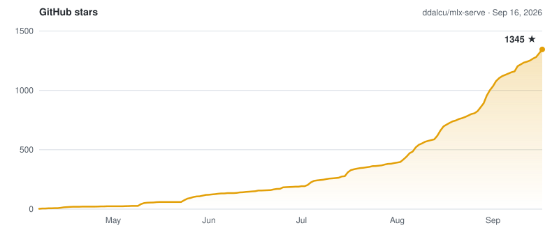

# mlx-serve —— 在你的 Mac 上运行任意 LLM

**面向 Apple Silicon 的本地推理，兼容 OpenAI 与 Anthropic —— 同时支持 MLX *与* GGUF，在相同的 MLX 权重上比 LM Studio 更快。无需 Python，不碰云端，不用 Electron。**

[](https://github.com/ddalcu/mlx-serve/releases/latest)
[](https://github.com/ddalcu/mlx-serve/stargazers)
[](https://github.com/ddalcu/mlx-serve/releases)
[](https://github.com/ddalcu/mlx-serve/commits/main)
[](LICENSE)
[](https://github.com/ddalcu/mlx-serve/releases/latest)
[](https://ziglang.org)
[](https://trendshift.io/repositories/43025)

[English](README.md) · [简体中文](README.zh-CN.md)

*本文件译自 [README.md](README.md)，如与英文原文有出入，以英文原文为准。*

**[mlxserve.com](https://mlxserve.com/)** · [下载 MLX Core.app](https://github.com/ddalcu/mlx-serve/releases/latest) · [文档](#文档) · [更新日志](CHANGELOG.md)

mlx-serve 是一个原生 Zig 服务器，让**任意 LLM 都能跑在 Apple Silicon 上** —— 既跑 MLX 格式的模型，也跑 HuggingFace 上的每一个 GGUF（Qwen、Llama、Mistral、Gemma、DeepSeek V4 Flash，还有成千上万个）。它开箱即用，同时暴露**兼容 OpenAI** *与* **兼容 Anthropic** 的 HTTP API，所以同一个 `http://localhost:11234` 就能服务 Claude Code、OpenAI SDK、Continue、Cursor、Open WebUI，以及任何支持这两种协议的客户端。文本之外，同一个服务器还能在 MLX 上原生生成**图像、视频、音乐、语音（含语音克隆）与 3D 模型**。随包提供 **MLX Core** —— 一款带聊天、Agent 模式、MCP 工具调用与模型管理的 macOS 菜单栏应用。

## 快速开始

需要 Apple Silicon 上的 macOS 26.2+。

### 用应用（推荐）

**MLX Core** 是一款已签名、已公证的 macOS 菜单栏应用，内置服务器。用带进度界面的方式浏览和下载模型、聊天、用 MCP 工具跑 Agent 模式、生成图像 / 视频 / 音乐 / 语音 / 3D，并在设置窗口里调整每一项服务器参数。不需要终端，没有任何要配置的东西。它底下的服务器与 CLI 运行的是同一个二进制、同一个 `http://localhost:11234`，所以应用运行期间，Claude Code 和任何 OpenAI 或 Anthropic 客户端都能直接连上。

[](https://github.com/ddalcu/mlx-serve/releases/latest) **[下载 MLX Core.app](https://github.com/ddalcu/mlx-serve/releases/latest)** —— macOS（Apple Silicon）最新版本

### 通过 Homebrew 安装

```bash
brew tap ddalcu/mlx-serve https://github.com/ddalcu/mlx-serve
brew install --cask mlx-core   # 应用（推荐）
brew install mlx-serve         # 仅 CLI + 服务器，不含 GUI
```

### 更喜欢终端？

如果你习惯 Ollama 那一套：

```bash
mlx-serve run gemma4        # 下载 Gemma 4 E4B（4-bit）、对外提供服务，并直接在终端里聊天
mlx-serve pull qwen3.6:27b  # 只下载（断点续传，直接来自 Hugging Face）
mlx-serve list              # 磁盘上有什么
mlx-serve serve             # 把你拉取过的模型全部对外提供 —— 模型按名字按需加载
```

短名称、`org/repo` 形式的 HuggingFace id 与 `name:tag` 都能用。面向脚本和无图形界面 Mac 的直接 `--model`/`--model-dir` 调用方式，以及每一项服务器参数，都在 [docs/cli.md](docs/zh-CN/cli.md)。

而且 mlx-serve 在 OpenAI 与 Anthropic 之外**还支持 Ollama API**（`/api/chat`、`/api/generate`、`/api/tags`、`/api/embed`、`/api/pull` 等），所以你现有那些连 Ollama 的工具 —— Raycast、Obsidian、Enchanted、Open WebUI、`ollama-python`/`js` —— 无需任何改动：把地址指向 `http://localhost:11234`，工作流照旧，引擎更快。

### 从源码构建

需要 Xcode 26.2+ 与 Metal Toolchain 组件（若 `xcrun -sdk macosx metal --version` 失败，先运行 `xcodebuild -downloadComponent MetalToolchain`）：

```bash
git clone --recurse-submodules https://github.com/ddalcu/mlx-serve && cd mlx-serve
brew bundle install --file=Brewfile   # cmake + webp
./app/build.sh                        # 应用 + 服务器，ad-hoc 签名
```

就这么些。Zig、mlx 与 llama.cpp 都已固定版本，由脚本拉取或构建，整条构建链里没有任何 Python。仅构建服务器见 [docs/building.md](docs/zh-CN/building.md)。

## 为什么选 mlx-serve


如果你已经在用 LM Studio、Ollama 或 `mlx-lm`，正犹豫要不要换 —— 下面是简短的正面对比：

| | mlx-serve | LM Studio | Ollama | mlx-lm |
|---|:---:|:---:|:---:|:---:|
| MLX 模型（Apple 原生） | ✅ | ✅ | 🟡 | ✅ |
| GGUF 模型（llama.cpp） | ✅ **内置** | ✅ | ✅ | ❌ |
| 兼容 OpenAI 的 API | ✅ | ✅ | 部分 | ❌ |
| Anthropic Messages API | ✅ | 🟡 部分² | ❌ | ❌ |
| Ollama API（可直接替换 Ollama 客户端） | ✅ | ❌ | ✅ 原生 | ❌ |
| 带自动下载 + REPL 的 `run <model>` CLI | ✅ | ❌ | ✅ | ❌ |
| OpenAI Responses API + WebSockets | ✅ | 🟡 部分² | ❌ | ❌ |
| DeepSeek V4 Flash（284B） | ✅ 经 ds4 | ❌ | ❌ | ❌ |
| 类型化决策（Laya，`POST /v1/decisions`） | ✅ | ❌ | ❌ | ❌ |
| 投机解码（PLD + 草稿模型 + 原生 MTP） | ✅ | ❌ | 部分 | 仅草稿模型 |
| 解码速度（相对 LM Studio 的几何均值，相同权重） | **+26%**（MLX，默认设置） | 基线 | 约 −15%（GGUF，估算¹） | +11%（MLX） |
| KV cache 量化（4/8-bit） | ✅ | ❌ | 部分 | ✅ |
| 连续批处理 | ✅ | ❌ | ✅ | ❌ |
| 内置 Agent 循环 + MCP 客户端 | ✅ 10 个工具 | ❌ | ❌ | ❌ |
| 沙盒化 Agent shell（隔离的 Linux 虚拟机） | ✅ | ❌ | ❌ | ❌ |
| 局域网模型共享（用另一台 Mac 的模型） | ✅ | ❌ | ❌ | ❌ |
| 一键启动器（Claude Code、OpenCode、Pi） | ✅ | ❌ | ❌ | ❌ |
| 运行时需要 Python | ❌ | ❌ | ❌ | ✅ |
| 原生菜单栏应用（无 Electron） | ✅ | ❌ Electron | ❌ | ❌ |
| **图像生成 + 照片编辑** | ✅ | ❌ | ❌ | ❌ |
| **视频生成**（文本 / 图像 / 音频 → 视频） | ✅ | ❌ | ❌ | ❌ |
| **语音 + 语音克隆** | ✅ | ❌ | ❌ | ❌ |
| **音乐生成** | ✅ | ❌ | ❌ | ❌ |
| **3D 生成**（图像 → 带纹理的 3D 模型） | ✅ | ❌ | ❌ | ❌ |
| 许可协议 | MIT | 专有 | MIT | MIT |

¹ Ollama 除少数 NVFP4 转换版本外跑不了 MLX，所以这里是 GGUF 对 GGUF。
² 近期 LM Studio 构建已带上 Anthropic `/v1/messages` 与 OpenAI `/v1/responses` 兼容端点，但对两套接口的覆盖都不完整 —— mlx-serve 另外还实现了 Responses 的 WebSocket 传输与 `/v1/responses/compact` 之类。

数字与图表见[性能](#性能)。

## 亮点

- **任意模型：** 所有受支持的 MLX 架构，加上通过内置 llama.cpp 覆盖的整个 GGUF 世界；DeepSeek V4 Flash 走专门的 [antirez/ds4](https://github.com/antirez/ds4) 引擎。
- **一个端口，四套 API 接口面：** OpenAI chat/completions 与 Responses（带 WebSocket 传输）、Anthropic Messages，以及 Ollama API。完整参考见 [docs/api.md](docs/zh-CN/api.md)。
- **现代服务端的完整能力：** 流式、带 schema 驱动自动修复的工具调用、JSON schema 约束解码、logprobs、视觉、以 `reasoning_content` 返回的思考内容。
- **适配你的编码 Agent：** Claude Code、pi、oh-my-pi、OpenCode、OpenCode 2、Codex、hermes、aider，以及 Zed 这类编辑器。在应用里一键启动，或在终端跑 `mlx-serve launch <agent>`，两者都会预配好服务器真实的上下文窗口。每个工具的配置见 [docs/integrations.md](docs/zh-CN/integrations.md)。
- **快：** 四种投机解码（PLD、模型自带的配套草稿模型、Gemma 4 草稿模型、原生 Qwen MTP）、自定义 Metal kernel、连续批处理、KV cache 量化、前缀与分词缓存。数字见 [docs/performance.md](docs/zh-CN/performance.md)。
- **内置 Web 控制台：** 在浏览器里打开 `http://localhost:11234`，就有聊天演练场、实时监控、图像与音频工具，以及 API 参考。
- **局域网模型共享：** 零配置，通过 Bonjour 使用另一台 Mac 的模型；连指向 `localhost` 的 Claude Code 也能跑到 Studio 上的 27B 模型。
- **媒体生成：** 图像、视频、音乐、含语音克隆的语音，以及 3D，全部在 MLX 上原生完成，来自同一个服务器。
- **无需 Python：** 一个约 7 MB 的 Zig 二进制。应用把一切签名并公证后随包提供。

## 图像、视频、音乐、语音、3D

一个服务器，五种模态。在应用里它们是菜单栏面板（点击、下载、生成）；走 HTTP 时就是 `/v1/images`、`/v1/audio`、`/v1/video` 与 `/v1/3d` 端点。你也可以直接在聊天里要媒体内容：要一张图、一句台词、一首曲子或一段短片，它会在对话里内联渲染。

| 功能 | 默认 | 其他选项 | 约需内存 |
|---|---|---|---|
| 图像 | FLUX.2-klein 4B 4-bit（mflux，约 5 GB 预量化） | FLUX.2-klein 9B（10 GB）、Krea-2-Turbo、Mage-Flow Turbo / Edit 8-bit（8.5 / 9.1 GB） | 8 / 12 / 16 GB |
| 视频 | LTX-Video 2.5 4-bit（36 GB，内置文本编码器） | LTX-Video 2.5 8-bit（59 GB，更锐利 + 扩散解码器）、LTX-Video 2.3、MiniMax-H3（Hailuo 3.0）4-bit / 8-bit，视频**与**配套音轨一次生成 | LTX 需 24 GB 内存；H3 需 26 GB（40 GB）或 44 GB（69 GB） |
| 语音 | Qwen3-TTS 1.7b（语音克隆） | Qwen3-TTS 0.6b、Kokoro-82M（54 种音色，约 345 MB） | 8 GB 内存，首次运行约下载 3.5 GB |
| 音乐 | ACE-Step 1.5 XL Turbo 8-bit（快，8 步） | MiniMax Music 3 8-bit（唱你的歌词，歌曲最长 6 分钟） | ACE 需 8 GB 内存、约 6.2 GB 下载；Music 3 约 20 GB 内存、13.6 GB 下载 |
| 3D | Hunyuan3D-2.1 8-bit（形状 + PBR 纹理） | — | 16 GB 内存 |

它远不止 text-to-X：按指令编辑照片、图像到图像、让你的照片动起来、与真实音频同步的会说话角色、用几秒音频做语音克隆、完整音乐曲目、照片转 GLB 的 3D 模型，以及可叠加的风格 LoRA。完整导览见 [docs/app.md](docs/zh-CN/app.md)。

## MLX Core（macOS 应用）

把服务器包装成完整界面的菜单栏应用：

- **聊天 + Agent 模式：** 多会话聊天、PDF 与图像、10 个内置工具（可逐工具审批）、MCP 市场、基于提示词的技能、持久记忆、文件夹 RAG。
- **Agents：** 具名助手，各自带性格、音色、模型、工具、工作区与唤醒词。
- **Agent 沙盒：** 打开一个开关，每个 Agent 的 shell 命令就都跑在一秒内启动的隔离 Linux 虚拟机里。你的 Mac 毫发无损。
- **模型浏览器：** 断点续传的多连接下载；能找到你已有的 LM Studio 模型，不重复下载。
- **免提语音模式：** 说一句 “Hey Loki” 就能开聊；用 54 种 Kokoro 音色回答，或用你自己克隆的音色。
- **随处可达：** 覆盖任意应用的 ⌃Space 快速启动器、连到手机的 Telegram 桥接、用自然语言写的定时任务、Mac 之间的局域网共享。
- **服务器管理：** 一个能感知引擎的设置窗口，收纳每一项启动参数，外加实时日志、启动 / 停止。

完整功能列表见 [docs/app.md](docs/zh-CN/app.md)。

## 支持的模型

原生 MLX 调度支持 Gemma 3/4、DiffusionGemma、Qwen 3 / 3.5 / 3.6 / 3.8 / 3-Next、Meta 的 Muse-Glimmer-30B、inclusionAI Ling 3.0、DeepSeek V4 Flash（284B）、腾讯 Hunyuan 3（295B）、Thinking Machines Inkling Small（276B）、poolside Laguna、Llama 3.x、Mistral、Nemotron-H、LFM2/2.5（含 VL 视觉版本），以及嵌入模型（BERT、EmbeddingGemma、Qwen3-Embedding）和 Laya 类型化决策模型（`POST /v1/decisions`）。其他任何模型都以 GGUF 形式跑在内置 llama.cpp 上，按格式自动路由。含 `model_type`、聊天格式与视觉支持的完整表格见 [docs/models.md](docs/zh-CN/models.md)。

## 性能

Apple M4 Max，各引擎权重完全相同，每个引擎都用出厂默认设置。[benchmarks.md](benchmarks.md) 逐个版本记录解码 tok/s；方法论、投机解码细节与调优指南见 [docs/performance.md](docs/zh-CN/performance.md)。


*代码补全解码 tok/s，v26.8.3，对比 LM Studio 0.4.19+2、oMLX 0.5.2 与 MTPLX 2.5.3，四个引擎加载的是完全相同的 MLX 权重文件。几何均值解码：**比 LM Studio 快 26%**、**比 oMLX 快 25%**，预填充则分别快 36% 与 10%。真正的两场对打发生在对手自己的检查点上：在它的 oQ4e 构建上（预填充档），**解码快 23%**；在它自己的 MTPLX-Optimized 构建上，**解码快 10% / 预填充快 17%**。*

投机解码有四种形式（PLD、模型自带的配套草稿模型、Gemma 4 草稿模型、原生 Qwen MTP），全部与贪心解码等价，并带自适应门控，让新颖内容型负载保持同等水平。细节见 [docs/performance.md](docs/zh-CN/performance.md)。

## 文档

- [docs/cli.md](docs/zh-CN/cli.md) —— CLI 命令与每一项服务器参数
- [docs/api.md](docs/zh-CN/api.md) —— 完整 HTTP API 参考：OpenAI、Anthropic、Ollama、媒体端点
- [docs/integrations.md](docs/zh-CN/integrations.md) —— 接入编码 Agent 与编辑器：Claude Code、pi、oh-my-pi、OpenCode、Codex、hermes、aider、Zed、OpenClaw
- [docs/models.md](docs/zh-CN/models.md) —— 支持的模型架构
- [docs/app.md](docs/zh-CN/app.md) —— MLX Core 应用的全部能力，含媒体生成导览
- [docs/performance.md](docs/zh-CN/performance.md) —— 基准测试、投机解码、调优旋钮
- [docs/building.md](docs/zh-CN/building.md) —— 从源码构建
- [docs/faq.md](docs/zh-CN/faq.md) —— 常见问题

## 常见问题

简短回答都在 [docs/faq.md](docs/zh-CN/faq.md)。问得最多的：

- [mlx-serve 比 LM Studio 更快吗？](docs/zh-CN/faq.md#mlx-serve-比-lm-studio-更快吗)
- [mlx-serve 能替代 Ollama 吗？](docs/zh-CN/faq.md#mlx-serve-能替代-ollama-吗)
- [mlx-serve 能和 Claude Code 一起用吗？](docs/zh-CN/faq.md#mlx-serve-能和-claude-code-一起用吗)
- [我的多台 Mac 能通过网络共享模型吗？](docs/zh-CN/faq.md#我的多台-mac-能通过网络共享模型吗)
- [mlx-serve 能在本地运行 DeepSeek V4 Flash 吗？](docs/zh-CN/faq.md#mlx-serve-能在本地运行-deepseek-v4-flash-吗)
- [我的数据去哪儿了？](docs/zh-CN/faq.md#我的数据去哪儿了)

## 致谢

mlx-serve 站在许多开源项目的肩膀上：[MLX](https://github.com/ml-explore/mlx) · [mlx-c](https://github.com/ml-explore/mlx-c) · [mlx-lm](https://github.com/ml-explore/mlx-lm) · [llama.cpp](https://github.com/ggerganov/llama.cpp) · [antirez/ds4](https://github.com/antirez/ds4) · [jinja.cpp](https://github.com/wangzhaode/jinja.cpp) · [nlohmann/json](https://github.com/nlohmann/json) · [stb_image](https://github.com/nothings/stb) · [libwebp](https://chromium.googlesource.com/webm/libwebp) · [HuggingFace tokenizers](https://github.com/huggingface/tokenizers) · [Zig](https://ziglang.org) · [Homebrew](https://brew.sh/)，以及来自 Google、Qwen、Meta、Mistral AI、NVIDIA、Liquid、DeepSeek、腾讯、poolside、Thinking Machines、Black Forest Labs 与 Lightricks 的模型和媒体架构，还有应用里的 [Anthropic](https://github.com/anthropics/swift-sdk) 与 [MCP](https://github.com/modelcontextprotocol/swift-sdk) Swift SDK。

引擎里一些最快的 Metal 路径最初是别人的工作，源码在每一处都写明了出处：

- [MTPLX](https://github.com/youssofal/mtplx)，作者 Youssof Altoukhi（Apache-2.0）：verify-width split-K 量化矩阵乘法系列与 M5 NAX tensor-ops tile。他们自己偏好的署名方式是：*Powered by MTPLX by Youssof Altoukhi.*
- [dflash-mlx](https://github.com/bstnxbt/dflash-mlx)（Apache-2.0）：NAX tile 所基于的 matmul2d 约定，经由 MTPLX 引入。
- oMLX，作者 jundot（Apache-2.0）：GatedDeltaNet 的分块序列预填充 kernel，以及让长上下文预填充避开 macOS 抢占悬崖的分块调度预算。
- [mlxfast-challenge](https://github.com/Layr-Labs/mlxfast-challenge)，作者 Layr Labs（MIT）：经认证的 lm_head 剪枝。

完整许可证与必须的署名都在 [NOTICE](NOTICE)。如果我们漏了你，欢迎开 PR —— 任何在这里落地过代码、fixture 或修复的人，我们都很乐意加上。

## Star 历史

<picture>
  <source media="(prefers-color-scheme: dark)" srcset="docs/star-history-dark.svg">
  
</picture>

<!-- regenerate with: python3 scripts/star-chart.py -->

## Mac Studio 基金

mlx-serve 是在一台 16 GB 的 M4 Mac mini 和一台 128 GB 的 M4 Max 上开发的，最近瓶颈已经变成机器而不是代码：

- **校准量化版本。** 给一个 284B 模型做 imatrix 校准的镜像，意味着要同时放下源权重和输出结果。它们放不下，于是转换器一次下载、转换、清除一个分片组，单次运行要耗掉大半天。在 512 GB 的机器上，一遍就完事。
- **大型架构。** Inkling、Laguna、Hunyuan 3 与 DeepSeek V4 Flash 都能在 128 GB 上加载，但权重旁边只剩约 3K 上下文的空间，所以它们的 Agent 负载在这里基本没法真正测。
- **基准测试。** 一次发布矩阵要跑掉几个小时的墙上时间，而热漂移要求在两组之间冷却、单独运行。多一台机器，基准测试就不再堵住开发。

所以有了一个买 Mac Studio Ultra 的基金。如果 mlx-serve 帮你省下过一笔 API 账单，你也愿意出一份力，按钮在[这里](https://github.com/sponsors/ddalcu)（或 [Buy Me a Coffee](https://buymeacoffee.com/ddalcu)）。无论是否出钱，都不会有功能被收费：现在 MIT，以后也 MIT。

**进度：** ▱▱▱▱▱▱▱▱▱▱ 2%

### 感谢

@jcprichard
@skudinov
@davidfekke
@lojza3d
@cpko
@d-b
@alinselea
Johnny Dang
@R0xr1te

每一位出过力的人都会在这里有一行，愿意的话附上链接，或者保持匿名。（给我发消息）提前谢谢你。

## 关注

关于底层实现的构建、基准测试与拆解：

- **YouTube** —— [@DavidDalcu](https://www.youtube.com/@DavidDalcu)
- **X** —— [@ddalcu](https://x.com/ddalcu)

订阅、关注、给仓库加 star 都不花钱，而且确实能帮项目触达更多人。这是最省力的支持方式。

## 许可

MIT，见 [LICENSE](LICENSE)。

mlx-serve 打包了仍按各自许可证分发的第三方代码，包括一些 Apache-2.0 的 Metal kernel 和渲染聊天模板的 Jinja 引擎。[NOTICE](NOTICE) 列出了全部内容与必须的署名，[LICENSE-APACHE-2.0](LICENSE-APACHE-2.0) 是 Apache 许可证文本。

---

★ **觉得有用？[给仓库加 star](https://github.com/ddalcu/mlx-serve/stargazers)、[订阅 YouTube](https://www.youtube.com/@DavidDalcu)、[在 X 上关注](https://x.com/ddalcu)。这真的能帮更多人发现它。**
