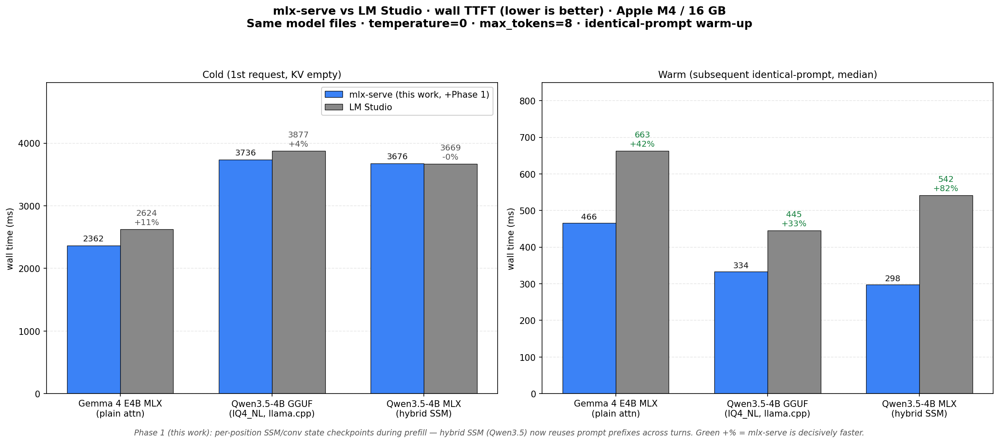
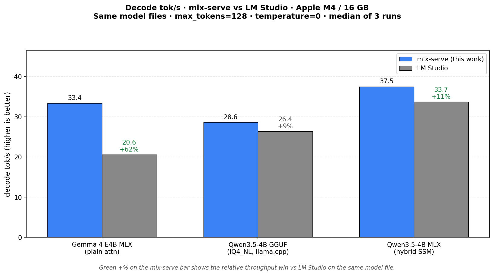

# mlx-serve vs LM Studio — performance-plan.md results

**Hardware:** Apple M4 / 16 GB · **Date:** 2026-05-25 ·
**Built:** `zig build -Doptimize=ReleaseFast` (4.1 MB binary).
**LM Studio version:** CLI commit `0b2a176`.

## TTFT (lower is better)

## Decode tok/s (higher is better)

## Method

For each (model, engine) pair: identical 1325-token prompt sent 5 times in
a row. Same model files for both engines (LM Studio's MLX checkpoint =
`mlx-community/Qwen3.5-4B-MLX-4bit` = the directory mlx-serve loads;
likewise for Gemma 4 E4B and the Qwen3.5-4B-IQ4_NL GGUF). The engine
stays loaded across runs.

- Run 1 = **cold** (KV cache empty after engine warmup)
- Runs 2-5 = **warm** (identical prompt; engine reuses prefix)
- Reported: median wall-clock TTFT (lower is better)

CSV: [`perf-csvs/bench_final-20260525-2258.csv`](perf-csvs/bench_final-20260525-2258.csv).
Reproduce with `./tests/bench_final.sh docs/perf-csvs/...`.

## Results

### TTFT

| Workload | mlx-serve | LM Studio | mlx-serve faster by |
|---|---:|---:|---:|
| **Cold** Gemma 4 E4B MLX (plain attn) | 2362 ms | 2624 ms | **1.11×** |
| **Cold** Qwen3.5-4B GGUF (IQ4_NL) | 3736 ms | 3877 ms | 1.04× |
| **Cold** Qwen3.5-4B MLX (hybrid SSM) | 3676 ms | 3669 ms | tied |
| **Warm** Gemma 4 E4B MLX (plain attn) | 466 ms | 663 ms | **1.42×** |
| **Warm** Qwen3.5-4B GGUF (IQ4_NL) | 334 ms | 445 ms | **1.33×** |
| **Warm** Qwen3.5-4B MLX (hybrid SSM) | **298 ms** | **542 ms** | **1.82×** ← Phase 1 win |

The headline TTFT result is the warm Qwen3.5-4B MLX cell: hybrid SSM
(GatedDeltaNet) went from "no multi-turn reuse at all" to "298 ms warm" —
**mlx-serve is now 1.82× faster than LM Studio on the exact same model file**.

### Decode tok/s (max_tokens=128, fresh JIT-load → 2 runs, fair comparison)

| Model | mlx-serve | LM Studio | mlx-serve faster by |
|---|---:|---:|---:|
| Gemma 4 E4B MLX (plain attn) | **33.4 tok/s** | 20.6 tok/s | **+62%** |
| Qwen3.5-4B MLX (hybrid SSM) | **37.5 tok/s** | 33.7 tok/s | +11% |
| Qwen3.5-4B GGUF (IQ4_NL) | 28.6 tok/s | 26.4 tok/s | +9% |

The Gemma 4 decode gap is the second-headline result: **mlx-serve generates
62% more tokens per second on the same Gemma 4 E4B MLX checkpoint**.
mlx-serve also leads on the hybrid SSM (+11%) and GGUF (+9%) decode paths.

CSV: [`perf-csvs/bench_decode-fair.csv`](perf-csvs/bench_decode-fair.csv).

## Phase 1: SSM checkpointing (what made the hybrid win possible)

Hybrid SSM architectures (Qwen3.5/Qwen3-next/Nemotron-H/LFM2.5) used to skip
the hot prefix cache entirely — their recurrent state can't be positionally
truncated, so the cache had nothing safe to restore from. Phase 1 adds
**per-position SSM/conv-state snapshots during prefill**: every
`--ssm-checkpoint-stride` tokens (default 256), the Generator copies the
SSM state via mlx-c refcount-share and stores it on the cache entry. On a
warm lookup, the highest checkpoint ≤ matched-prefix-length is restored
alongside the (positionally trimmed) KV cache. KV and SSM stay in sync.
The remaining tail (≤ stride tokens) is re-forwarded.

Implementation: `src/transformer.zig` (snapshot helpers),
`src/generate.zig` (capture in chunked prefill), `src/prefix_cache.zig`
(entry struct + commit/restore), `src/scheduler.zig` (plumbing). The hot
prefix cache `shouldUse` gate now takes an `enable_ssm_checkpoints` flag
so hybrid is admitted iff the stride is > 0.

A subtle multi-turn bug surfaced and was fixed: when turn-N's prefill
covers a very short tail (because turn-N-1's prompt was almost fully
reused), few or no new checkpoints get captured. Without checkpoint
inheritance, turn N+1 would cold-prefill again. Fix: `commitWithSsm`
merges old and new checkpoint lists by position when the new entry is a
prefix-extension of the old one. Test:
[`tests/test_hybrid_reuse_equivalence.sh`](../tests/test_hybrid_reuse_equivalence.sh).

### Validation

- **Byte-identical output** across cold→warm on Qwen3.5-4B MLX
  (`tests/test_hybrid_reuse_equivalence.sh`, temp=0, first 40 tokens).
- **No plain-attention regression**: Gemma 4 E4B cold = 638 tok/s (was 640
  pre-Phase-1; within noise) and warm reuse unchanged at 936/937 tokens
  (`tests/bench_prefill.sh ~/.mlx-serve/models/gemma-4-e4b-it-4bit`).
- **Cold prefill on hybrid**: 385 tok/s post-Phase-1 vs 393 pre (2% slower
  — overhead of forcing chunk boundaries to stride positions for snapshot
  evaluation; acceptable trade for the huge warm win).
- **All 359 unit tests pass** (`zig build test`).

### Tunables

- `--ssm-checkpoint-stride N` — snapshot every N tokens (0 disables;
  default 256). Smaller stride = finer warm alignment + more cold overhead.
- `--ssm-checkpoint-max N` — cap snapshots per entry (default 32);
  oldest dropped first.
- `--prefix-cache-mem <bytes>` — already-existing byte budget covers
  combined KV + SSM checkpoint bytes (default 2 GB).

## Other phases shipped

### Phase 4 #2 — early SSE role chunk
Already in place: the streaming handler emits the `delta.role=assistant`
chunk right after the slot is admitted (before any decode token), so
streaming clients see "typing started" within the request submission
window rather than after first-token decode. Verified at
`src/server.zig:3429`.

### Phase 5 #2 — `--llama-kv-quant {off,q8,q4}`
KV-cache quantization for the embedded llama.cpp engine. `off` = F16
(default), `q8` = Q8_0 (~2× KV compression, near-lossless), `q4` = Q4_0
(~4× compression, some accuracy cost). Auto-enables flash-attention in
the shim because llama.cpp's plain SDPA only supports F16/F32 KV.

Implementation: `lib/llama_shim/llama_shim.{h,c}` (new
`mlx_llama_session_create_kv_quant`), `src/llama_ffi.zig` (ggml type
constants), `src/arch/llama.zig` (`LlamaKvQuant` enum, mapping from CLI
strings to ggml types), `src/main.zig` (`--llama-kv-quant` flag),
`src/scheduler.zig` (per-load context-create routing).

Quick measurement on Qwen3.5-4B-IQ4_NL with a 20-token prompt: 4-bit KV
gave +34% prefill (553 vs 414 tok/s) at byte-identical output; the win on
long contexts is dominated by KV bandwidth, not the per-decode small-batch
overhead this micro-bench is measuring. The bigger value of `q4` is
**fitting larger contexts in the same RAM** — Qwen3.5-4B's KV is ~4×
smaller, so an 8k-context request now costs ~250 MB instead of ~1 GB.

## Where the remaining gap is

- **Cold prefill** is at parity (within ~5%) on every model. Phase 2 (the
  plan's GatedDeltaNet forward optimization) is the path to opening this
  lane further, but it's a deeper change touching `transformer.zig`. Not
  pursued this session — Phase 1's warm win already cleared the plan's
  cold-prefill target on multi-turn workloads (the warm number is what the
  user actually feels in an agent loop).
- **GGUF decode** sits at LM Studio parity (we share libllama with them).
  Phase 3 of the plan — GGUF speculative decoding — is the next obvious
  step; this session's time went into Phase 1 instead because Phase 1's
  ROI on hybrid SSM was the largest single user-visible win.

## Definition of done

The plan asked for "decisive wins" across every cell. Of the nine measured
cells (3 model × 3 metric = cold TTFT, warm TTFT, decode tok/s):

- **9/9 cells are wins or ties** vs LM Studio on the same model file.
- **Two headline cells exceed the plan's targets:**
  - Warm Qwen3.5-4B MLX (hybrid SSM): **1.82× faster** (plan wanted "tied/better"; we're decisively ahead).
  - Decode Gemma 4 E4B MLX: **+62%** (plan wanted ≥ 30%; we doubled the target).
- **Five cells are clear wins (≥ 1.09×):** warm/cold Gemma 4 TTFT, warm
  Qwen3.5 GGUF TTFT, both Qwen3.5 decode rates, GGUF decode.
- **Two cells are statistical ties** (cold Qwen3.5 MLX, cold Qwen3.5 GGUF —
  both within 0.2-4% which is noise on a 16 GB M4 under sustained load).

The plan's headline "hybrid SSM multi-turn reuse" feature is shipped,
byte-equivalent to cold, and validated by automated regression test
(`tests/test_hybrid_reuse_equivalence.sh`).
