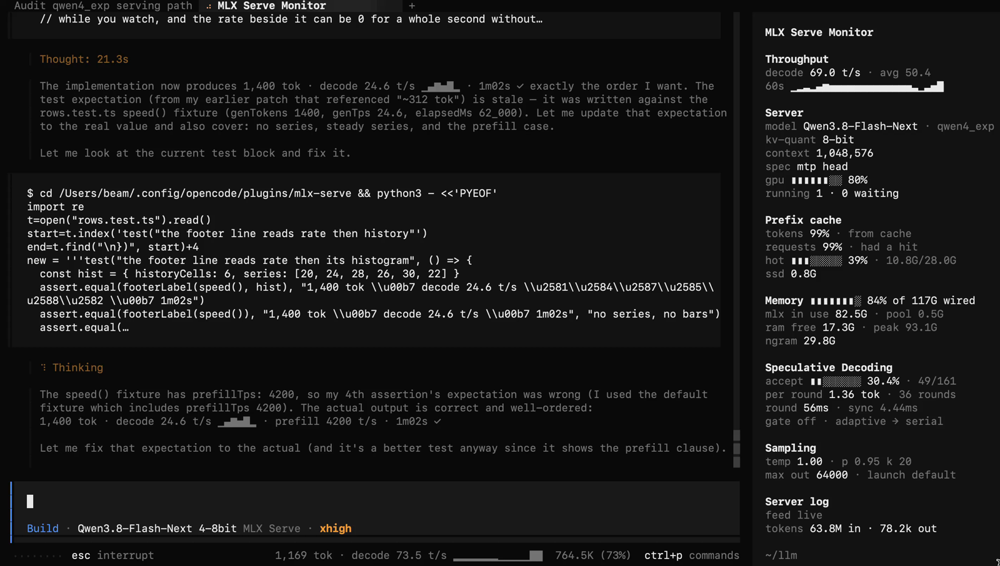

# MLX Serve Monitor



An OpenCode 2 CLI plugin that shows what a local **mlx-serve** is doing while it
is OpenCode's model: a stats panel in the session sidebar and a turn meter in the
prompt footer.

It only reads:

```
GET /metrics.json   counters, gauges, histograms        (needs the server's --metrics)
GET /props          memory headroom, n-gram warm total  (optional)
GET /v1/models      model, kv quant, MTP head           (optional)
tail  ~/.mlx-serve/logs/mlx-serve-<port>.log            [spec-stats], request lines, cache tiers
      (the port that answered /metrics.json, not the one configured)
```

MTP acceptance and the KV-cache tier sizes come from the log because the server
publishes them nowhere else. `[spec-stats]` is documented in
`mlx-serve/src/generate.zig` as a stable format for external tooling.

## Layout

| Surface | Where | Content |
| --- | --- | --- |
| Turn meter | prompt footer, always | `~1,833 tok · decode ~24.0 t/s` |
| Stats panel | session sidebar | throughput, server, prefix cache, memory, speculative decoding, sampling, server log |

There are no slash commands. OpenCode 2 `beta-19296` does not dispatch CLI-plugin
commands into the prompt, so everything is either always-on or a `cli.json`
option. To hide the panel, hide the host sidebar (`<leader>b`, or
`session.sidebar: "hide"`); that unmounts it and stops its slow reads. The turn
meter stays in the footer.

## Footer meter

The footer draws one line in a fixed handful of shapes, so it never breathes
while the numbers move. Every slot draws in every shape, zero-filled — nothing
pops in or out mid-turn:

```
prefill ███░░░░░░░░░ 12,400/48,000 · 1600 t/s · ~22s left   ← prefilling, mlx-serve
prefill 8,192 tok · 6827 t/s                              ← prefilling, server silent on the total
prefill waiting · 2.4s                                    ← prefilling a provider with no metrics feed
1,833 tok · decode 24.0 t/s · prefill 10.0k t/s           ← decoding mlx-serve
1,833 tok · decode ~22.5 t/s · ttft 2.40s                 ← decoding any other provider
0 tok · decode 0.0 t/s · prefill 0.0 t/s                  ← quiet zeros between steps
```

- Token counts print in full with thousands separators; rates use the compact
  form (`10.2k t/s`).
- `~` marks a count estimated from streamed bytes rather than reported by the
  server.
- The prefill bar's denominator is the real target: the server publishes
  `prefill_tokens_expected` (the post-cache tail it is about to forward)
  alongside the live count, on the same scale. No estimate, no `~`, nothing
  carried over from a previous step. A server that does not report it — older
  builds, the bypass engines — draws the plain rate shape instead of a bar.
  A fully-cached step forwards nothing and settles nothing: it reads as
  waiting, never `0/…`.
- A finished step retires the prefill phase even when no token ever flipped it,
  so the meter cannot freeze on a finished prefill between steps.

### Sessions on other providers

The local feed describes one machine. When a step's model reports another
provider — anything not in the `provider` option (default: both `mlx-serve`,
the hand-written id, and `mlx`, the one `mlx-serve launch opencode2` registers;
set it to `null` to meter every session from the feed) — that session ignores
the feed and is metered from its own API stream:

- Prefill is the wait: the footer counts it up (`prefill waiting · 2.4s`).
  `session.step.streamed`, the host's first-streamed-content event, fixes the
  TTFT when the provider starts answering.
- Decode is the streamed-byte estimate (`~22.5 t/s`), scaled by `bytesPerToken`
  exactly as the mlx-serve fallback is.
- At `session.step.ended` the provider's usage (`input − cache.read`) over that
  TTFT settles a prefill rate, and the decode shape's third slot shows
  `prefill 4.5k t/s` instead of `ttft 2.40s`. Without usage it keeps the TTFT.
- The panel's Turn section draws the same numbers; the server sections still
  describe the local mlx-serve, which is what they are for.

## Panel sections

Only sections with data are drawn, in the order given by `sections`. The Server
log heading names the feed state (`· live`, `· unreachable`, …) even when
everything else is empty, so an unreachable server is visible rather than
absent.

| Section | Rows |
| --- | --- |
| Throughput | `decode` and `prefill` on permanent lines; while a prefill runs the `prefill` line is the real progress bar (`prefill ███ 24.0k/48.0k · 4.2k t/s`), otherwise it is the rate with its since-boot average; a 60-second sparkline and admitted req/s |
| Server | live serving statistics, always in this order: `gpu` (0% is a reading, not a missing number), `running N · M waiting`, since-boot `tokens` in/out and `requests`, last request's `messages` and `tool calls` |
| Prefix cache | share of billed prompt tokens restored from cache, share of requests with a hit, `hot` and `ssd` tiers gauged against their own caps |
| Memory | a bar row `▮▮▮▮▮▮░░░░ 63%` with its ceiling dim behind it (`· of 117G wired`) when one is declared, else a plain `footprint` row; `mlx-serve` in-use vs pool, `free` RAM and peak, ANE bytes, n-gram table |
| Speculative Decoding | per-draft acceptance as gauge and percent, accepted per round, verify round time vs GPU→CPU sync, `gate off` when the runtime disabled speculation |
| Model & sampling | what model this is and how it sampled: `model`, `kv-quant`, `context` (exact digits), `spec mtp head · <arch>`, then what the last request ran with: `temp 1.00 · p 0.95 k 20`, `max out 64000 · launch default`, `stream off`, `route responses` |
| Server log | the log file, its size and last write, with the feed state (`· live` dim when well, `· unreachable` red when dark) as an aside on the heading |
| Turn (opt-in) | the footer meter's numbers as rows, prefill bar included |
| Attach | the plugin's own integration failures; appears on its own whenever a host API refused, and can also be listed in `sections` |

### One client or several

`generation_tokens_live` is a server-wide counter. With one request in flight the
footer meter and the Throughput section are the same measurement, and if `turn` is
in `sections` the Throughput `decode` line yields to the since-boot average
(`decode 68.9 t/s · since boot`) instead of repeating it. With two or more in
flight the footer meter switches to this session's streamed bytes (marked `~`)
while Throughput keeps the server's combined rate.

### Throughput lines do not come and go

A finished prefill used to take its line with it, and every line below the one
that moved was redrawn — twice a turn. So `decode`, `prefill` and `admitted` hold
their lines for as long as the feed answers, and a rate nothing is measuring now
reads as zero beside the average it does have:

```
Throughput                      ← what the section looks like while decoding
decode   30.0 t/s · avg 68.9
prefill   0.0 t/s · avg 1311    ← not prefilling: zero, and the average anyway
admitted  0.00 req/s
```

| Row | Prefilling | Decoding | Idle |
| --- | --- | --- | --- |
| `decode` | `0.0 t/s · avg 68.9` | `30.0 t/s · avg 68.9` | `0.0 t/s · avg 68.9` |
| `prefill` | `8192 t/s · avg 1311` | `0.0 t/s · avg 1311` | `0.0 t/s · avg 1311` |
| `admitted` | `0.00 req/s` | `0.00 req/s` | `0.00 req/s` |

`0.0` means the counter did not move in the window, not that it measured a slow
phase; the reason the window is empty (idle server, `--metrics off`, unreachable)
is in the Server log heading. The sidebar renders each row by its label, so
a line whose number merely changed is updated in place rather than rebuilt.

### Gauges, bars, sparklines

| Mark | Glyphs | Meaning |
| --- | --- | --- |
| gauge | `▮▮▮▮▮▮░░░░` | a level against its own limit (gpu, accept, cache tiers, wired ceiling) |
| progress | `████░░░░░░` | filling toward a total over time (prefill) |
| sparkline | `▁▂▅█▆▃` | a series over the last N cells |

With `ratioCells: 8` every row fits in 34 cells on live data; the sidebar
truncates the end of a line, so wider gauges cost the trailing figure.

### Memory ceiling

mlx-serve compares its working set against Metal's
`max_recommended_working_set_size`, which it never publishes. The plugin uses
`wiredLimitGb` if set, otherwise reads `iogpu.wired_limit_mb` once at load. With
neither it shows the footprint in bytes and draws no gauge rather than guessing a
denominator.

### Cache tier denominators

- `hot` is the RAM tier. Its log line carries its own budget, which is
  `ctx_kv_bytes + idle` (one session at the working context plus the
  `--prefix-cache-mem` idle allowance), so the gauge is measured. The flag alone
  is not the denominator.
- `ssd` is the disk tier under `~/.mlx-serve/kv-cache`. Its occupancy comes from
  the `[disk-cache] persisted … resident=` line; its cap (`--prefix-cache-disk`)
  appears nowhere, so the gauge is drawn only when `diskCacheGb` is set.

## Poll rates

| Situation | /metrics.json | /props, /v1/models, log |
| --- | --- | --- |
| panel on screen, server idle | `idlePollHz` (1/s) | every `propsSeconds` / `modelsSeconds` / `logSeconds` |
| a turn is running | `pollHz` (4/s) | same, plus one read at the end of every turn |
| sidebar hidden, turn running | `pollHz` (4/s) | never |
| idle, nothing visible | never | never |

"Nothing visible" is about this client: another client's requests do not start
the fast poll while the panel is hidden and no turn of ours is running.

The log tail reads only appended bytes and stops at the last complete line. A
backlog larger than its read cap is skipped forward to the last 256 KB in one
poll, and the skipped bytes are reported as `tail +N unread`. Lines read on the
first poll, after a rotation or after such a skip are stamped with the file's
mtime rather than the clock, so an old line is drawn with its age.

## Install

Requires OpenCode 2 with the CLI-plugin API and a Node that runs `.ts` files
directly (22.6 or later). Clone into OpenCode's plugin directory and register
it in `cli.json`:

```sh
git clone https://github.com/beamivalice/opencode2-mlx-serve.git ~/.config/opencode/plugins/mlx-serve
```

Start mlx-serve with `--metrics` (and `--api-key` if you set `metricsToken`).
OpenCode reloads CLI plugins on file change, so edits take effect without a
restart.

## Configuration

`~/.config/opencode/cli.json`:

```jsonc
{
  "plugins": [
    {
      "package": "./plugins/mlx-serve",
      "options": {
        "metricsUrl": "http://127.0.0.1:11234/metrics.json",
        "metricsToken": "mlx-serve",
        "sections": ["throughput", "server", "cache", "memory", "spec", "sampling", "log"],
        "provider": ["mlx-serve", "mlx"],
        "sparkCells": 24,
        "barCells": 12,
        "footerBarCells": 12,
        "ratioCells": 8,
        "diskCacheGb": 100,
        "wiredLimitGb": null,
        "refreshHz": 8,
        "pollHz": 4,
        "idlePollHz": 1,
        "propsSeconds": 15,
        "modelsSeconds": 30,
        "logSeconds": 5,
        "bytesPerToken": 4.75
      }
    }
  ]
}
```

- `metricsUrl` accepts a bare origin, `/metrics` or `/metrics.json`. `/props` and
  `/v1/models` derive from the origin that answered, the log path from its port.
- `metricsToken` is sent as `Authorization: Bearer …` (the server's `--api-key`).
- `logPath` defaults to `~/.mlx-serve/logs/mlx-serve-<port>.log` for the port
  that answered. Set `"off"` for
  a remote server or one started with `--log-file off`; the log, spec, sampling
  and cache-tier rows disappear.
- `sections` is the list of sections to draw, in order. Unknown names are
  ignored; an empty list draws nothing; a malformed value falls back to the
  default. Add `"turn"` or `"attach"` to opt those in; `attach` also appears by
  itself whenever a host integration threw.
- `provider` names the provider ids whose sessions the local feed may meter.
  Defaults to `["mlx-serve", "mlx"]` — the hand-written and launcher-generated
  ids. A string names one, a list names several, `null` accepts the feed for
  every session. A step whose model reports any other provider is metered from
  its own stream instead.
- `sparkCells: 0` removes the sparkline; `barCells` and `footerBarCells` are the
  prefill progress-bar widths in the panel and footer, capped at **12** blocks
  (both default to 12); set either to `0` to fall back to the plain rate;
  `ratioCells: 0` draws percentages without gauges.
- `diskCacheGb` is the SSD tier cap in GiB (`--prefix-cache-disk`).
- `wiredLimitGb` overrides the `iogpu.wired_limit_mb` sysctl.
- `bytesPerToken` is only used when the server gives no token counts.

### Port discovery

Nothing on disk names the live port: there is no pidfile and no server config,
only a log file per run and the process's own argv. So:

- The log tail is only opened after `/metrics.json` has answered (200, or 503 for
  a server with `--metrics` off), and it tails the port that answered. Until
  then the Server log section reads `waiting for a server`.
- With no `metricsUrl` set, the default is `127.0.0.1:11234`. If it does not
  answer — or if a URL you did set does not answer — the plugin lists
  `~/.mlx-serve/logs`, takes the three newest `mlx-serve-<port>.log` files and
  asks each port's `/metrics.json` with a 300 ms timeout, adopting the first that
  answers. Setting `metricsUrl` pins the feed: the probe only runs if that URL
  never answers.
- A link that stays down is re-probed every 30 seconds, so a server restarted on
  another port is picked up without a plugin reload.
- With no live feed, a candidate log file older than five minutes is treated as
  `no log file`: the log directory keeps one file per past run, and a dead run's
  last `[spec-stats]` line would otherwise read as current.

## Deploying elsewhere

Copy this directory and add the entry above. There are no absolute paths or
hostnames in the code. It needs OpenCode 2 (CLI-plugin API with the
`sidebar.content` and `prompt.footer.status` slots) and degrades by section:

| Target | Result |
| --- | --- |
| mlx-serve without `--metrics` | feed reads `--metrics off`; the footer meter still works from streamed bytes |
| older mlx-serve without ANE / n-gram / live gauges | those rows are absent |
| server on another host | HTTP sections work; set `logPath: "off"` |
| no `/props` or `/v1/models` | memory headroom and model rows drop out |
| a host API that throws | named in the Attach section and echoed to stderr |

## Files

| File | Role |
| --- | --- |
| `tui.tsx` | the CLI plugin: polling, event wiring, slots, the two renderers |
| `index.ts` | server-side plugin stub |
| `options.ts` | `cli.json` options and defaults |
| `stats.ts` | parsing of `/metrics.json`, `/props`, `/v1/models` and log lines; windowed rates; formatting |
| `rows.ts` | all wording: `footerLabel` and the panel sections |
| `logtail.ts` | incremental read of the server log, with rewind on rotation |
| `tracker.ts` | per-turn speed from streamed deltas and live gauges |
| `discover.ts` | which port the live server is on, and whether a log file is too old to trust |
| `schedule.ts` | when to poll: busy, wanted, and what is due |
| `fixtures.ts` | captured payloads and log lines for the tests |
| `probe-live.ts` | manual probe: `METRICS_URL=… PROBE_SECONDS=10 node probe-live.ts` |

## Tests

```sh
node --test
```

No dependencies, no network. `tui.tsx` is JSX the host transpiles at load time
and is not covered by the test run.

## Accuracy notes

- Prefill tok/s divides forwarded tokens by prefill time. Billed prompt tokens
  would overstate warm-cache prefill by `prompt / (prompt − cached)`.
- Live rates are windowed and go `null` when the feed goes stale, and so do the
  momentary gauges (`running`, `waiting`, `prefilling`, `gpu`).
- Live prefill tok/s divides by the time since `prefill_tokens_live` last read 0,
  not by a fixed window: the gauge resets per request.
- The `60s` sparkline draws an idle second as 0 and ends at now, so a tool pause
  is a gap rather than a repeat of the last rate.
- `[spec-stats]` is per request; the section shows the last completed request and
  adds an `age` row once the line is more than 90 seconds old.
- Counter resets (a server restart) clear the window history instead of producing
  a negative rate.
- Totals in Server log are the server's own since-boot counters. `tool calls` is
  the `role == "tool"` message count of the last prompt, so it is per
  conversation.
- mlx-serve publishes no uptime, so nothing here claims one.

## License

MIT. See [LICENSE](LICENSE).
